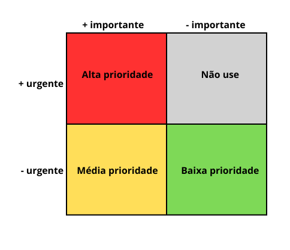

## Introdução

A técnica de priorização _Three Level Scale_<a id="anchor_1" href="#REF1">1</a> é uma abordagem comum para priorizar requisitos, que agrupa-os em três categorias. Essas categorias geralmente são: **alta**, **média** e **baixa** prioridade. Entretanto, como aplicar essa escala pode ser uma tarefa subjetiva, que gera diferentes interpretações, as partes devem conversar e decidir uma forma de avaliação padrão.

## Metodologia

Para padronizar a abordagem e deixá-la útil, o integrante [Rafael Pereira](https://github.com/rafgpereira) estudou uma análise em duas dimensões: **importância** e **urgência**. Dessa forma, os requisitos avaliados como urgentes e importantes tem alta prioridade, os menos urgentes mas ainda importantes tem média prioridade, e os menos importantes e menos urgentes são de baixa prioridade. Destaca-se que, nesse método, os que são avaliados como urgentes mas não tão importantes são considerados inúteis ou de baixa prioridade, já que muito provavelmente houve algum interesse pessoal de quem está priorizando, e, portanto, não são importantes. Veja na Figura 1 a distribuição das prioridades no quadro de duas dimensões.

    Figura 1: Three Level Scale bidimensional.

<b>Fonte:</b> <a href="https://github.com/rafgpereira">Rafael Pereira</a>, 2024

Para priorizar os requisitos utilizando essa metodologia, o desenvolvedor [Rafael Pereira](https://github.com/rafgpereira) convidou a usuária do Sympla Denise Cristina, explicou-a como funciona esse processo de priorização, e então mediou uma sessão de priorização com a usuária listando todos os requisitos elicitados, e obetiveram-se os resultados exibidos abaixo.

## Resultados

## **Referências bibliográficas**

><a id="REF1">1.</a> FIRST things first: Setting requirement priorities. In: WIEGERS, Karl E.; BEATTY, Joy. Software Requirements. 3. ed. [S. l.]: Microsoft Press, 2013. cap. 16, p. 313-329. ISBN 0735679665.

## Histórico de Versões

| Versão |          Descrição              |     Autor      |      Data      |   Revisor     | 
|:------:|:-------------------------------:|:--------------:|:--------------:|:-------------:|
|  1.0   | Criação do documento |  [Rafael Pereira](https://github.com/rafgpereira) | 23/11/2024 |[Victor Hugo](https://github.com/VHbernardes)  |
