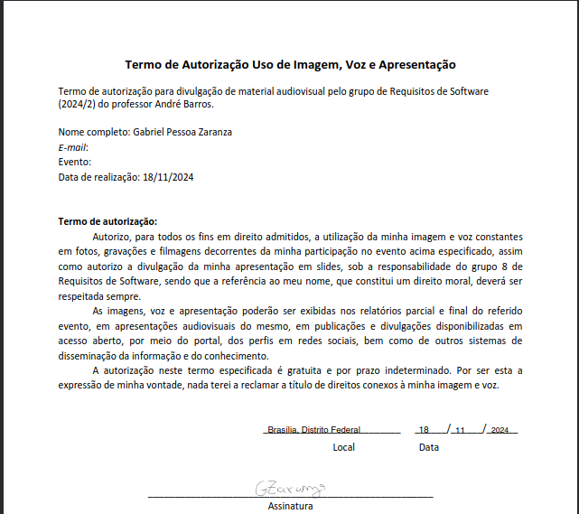
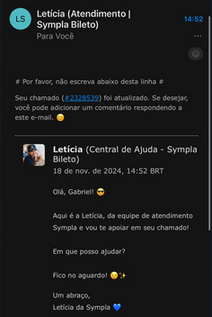

# Observação

## Introdução
A técnica de observação de requisitos é uma abordagem essencial para coletar informações sobre as necessidades de um software. Ela consiste em observar usuários, processos e sistemas em funcionamento para compreender as demandas e preferências dos usuários finais, além de identificar limitações e restrições no ambiente de uso do aplicativo. Agradecemos, desde já, a participação de Gabriel Pessoa, usuário que foi observado durante a utilização do app Sympla

No dia 18/11/2024, das 14:00 às 15:00, os integrantes se reuniram, conforme detalhado na Tabela 1, por meio do Microsoft Teams, com o propósito de realizar uma Observação Participativa, na qual o Engenheiro de Software exerce influência sobre o processo. Durante essa atividade, os observadores [Milena Rocha](https://github.com/MilenaFRocha) e [Gabriel Scheidt](https://github.com/Gxaite) orientaram o usuário Gabriel Pessoa sobre as ações a serem executadas no aplicativo da Sympla. O usuário compartilhou a tela de seu celular, enquanto os observadores guiavam os passos a serem seguidos. Os requisitos identificados estão registrados nas Tabelas 2 e 3.

### Cronograma de Reuniões

| **Data**    | **Horário** | **Atividade**                             | **Local**  | **Responsável** |
|-------------|-------------|-------------------------------------------|------------|-----------------|
| 16/11/2024  | -           | Contato inicial com Gabriel              | -          | Gabriel          |
| 18/11/2024  | 14:00       | Reunião com Gabriel                      | FGA      | Gabriel          |

### Participantes

Tabela 1: Participantes.

| Nome                                             | Função                   |
| ------------------------------------------------ | ------------------------ |
| [Milena Rocha](https://github.com/MilenaFRocha)  | Observador               |
| [Gabriel Scheidt](https://github.com/Gxaite)   | Observador |
| Gabriel Pessoa  | Observado |

Fonte: [Milena Rocha](https://github.com/MilenaFRocha) e [Gabriel Scheidt](https://github.com/Gxaite).

### Roteiro de Observação

## **Fluxo 1: Login e Cadastro**
1. Acessar a tela inicial e identificar as opções de login e cadastro.
2. Realizar o cadastro (novo usuário), observando:
   - Facilidade no preenchimento e validação de campos.
   - Integração com contas de terceiros (Google, Facebook, etc.).
3. Realizar o login, testando credenciais corretas e incorretas.
---

## **Fluxo 2: Busca de Eventos por Preferências**
1. Explorar categorias e filtros:
   - Localização, data, tipo de evento.
2. Usar a barra de busca:
   - Testar sugestões e relevância dos resultados.
3. Selecionar um evento:
   - Avaliar clareza das informações (data, local, descrição).
   - Testar marcar como favorito ou adicionar ao calendário.
4. Iniciar o processo de compra (se aplicável).

---

## **Fluxo 3: Suporte Técnico**
1. Identificar canais de suporte (chat, FAQ, e-mail ou telefone).
2. Entrar em contato para relatar um problema ou dúvida:
   - Avaliar tempo de resposta e clareza das respostas.
3. Testar a navegação nas FAQs e finalizar o contato.

---

## **Pontos Gerais a Observar**
- **Interface:** Clareza, organização e mensagens consistentes.
- **Desempenho:** Velocidade de carregamento e respostas rápidas.
- **Experiência:** Facilidade de uso e possíveis frustrações.

### Termo de uso de imagem
Abaixo está o temro de uso de imagem e voz do participante Gabriel Pessoa Zaranza na Figura 1.

Figura 1: Termo de Uso assinado.

### [Link para a gravação da observação.](https://www.youtube.com/watch?v=YAJ2Utv1DEg)
No dia 18/11/2024 a Observação foi realizada e publicada, o contéudo pode ser visto no Vídeo 1.

Vídeo 1: Requisitos grupo 8 - Sympla - Observação, 2024/2, UnB. 2024

<iframe width="560" height="315" src="https://www.youtube.com/embed/YAJ2Utv1DEg?si=hrKmBmviNJFMxqnc" title="YouTube video player" frameborder="0" allow="accelerometer; autoplay; clipboard-write; encrypted-media; gyroscope; picture-in-picture; web-share" referrerpolicy="strict-origin-when-cross-origin" allowfullscreen></iframe>

<b>Fonte:</b> Os Autores. Grupo 08 - Sympla - Entrega 1 - Requisitos de Software, 2024/2, UnB. 2024. Disponível em: <a href="https://www.youtube.com/watch?v=YAJ2Utv1DEg">https://www.youtube.com/watch?v=YAJ2Utv1DEg</a>. Acesso em: 21 nov. 2024.

Durante a observação realizada o usuário entrou em contato com a assistência técnica do aplicativo sympla afim de receber um direcionamento de como prosseguir com a compra do ingresso. O contato do usuário foi feito as 14:45 no dia 18/11/2024 e a resposta foi enviada e notificada por email as 14:52.

## Requisitos elicitados

Legenda das Tabelas 2 e 3:

- RFx: Requisito Funcional nºx
- RNFx: Requisito Não-Funcional nºx
- OBSx: Requisito nºx elicitado pela observação.

### Funcionais

Tabela 2: Requisitos Funcionais.

| Tipo | Descrição                                                                                                             |  ID | Implementado |
| ---- | --------------------------------------------------------------------------------------------------------------------- | ------------------------------------------------------ | ------------ |
| RF01 | O aplicativo filtra os eventos por Estado.                                                                            | OBS01                                                  | Sim          |
| RF02 | O aplicativo permite a busca por eventos.                                                                             | OBS02                                                  | Sim          |
| RF03 | O aplicativo permite compartilhar o evento por meio das redes sociais.                                                | OBS03                                                  | Sim          |
| RF04 | O aplicativo permite escolher a quantidade de ingressos que o usuário deseja comprar.                                 | OBS04                                                  | Sim          |
| RF05 | O aplicativo permite selecionar as poltronas para pessoas idosas, crianças, obesas ou com deficiência, caso as tenha. | OBS05                                                  | Sim          |
| RF06 | O aplicativo permite selecionar as poltronas especiais.                                                               | OBS06                                                  | Sim          |
| RF07 | Na seleção de ingresso, o aplicativo permite adicionar um cupom de desconto.                                          | OBS07                                                  | Sim          |
| RF08 | Caso o local do evento disponibilize, o aplicativo disponibiliza uma visão prévia da poltrona.                        | OBS08                                                  | Sim          |
| RF09 | O aplicativo permite a doação por parte do usuário para fundações.                                                    | OBS09                                                  | Sim          |
| RF10 | O aplicativo permite a realização da compra dos ingressos.                                                            | OBS10                                                  | Sim          |
| RF11 | O aplicativo possui uma função para entrar em contato com o suporte.                                                  | OBS11                                                  | Sim          |
| RF12 | O aplicativo permite ao usuário cancelar o pedido.                                                                    | OBS12                                                  | Sim          |
| RF13 | O aplicativo permite ao usuário alterar seus dados.                                                                   | OBS13                                                  | Sim          |
| RF14 | O aplicativo possui uma função que auxilia na recuperação da conta do usuário.                                        | OBS14                                                  | Sim          |

Fonte: [Milena Rocha](https://github.com/MilenaFRocha) e [Gabriel Scheidt](https://github.com/Gxaite).

### Não funcionais

Tabela 3: Requisitos Não-Funcionais.

| Tipo  | Descrição                                                                                                                                                                       | ID | Implementado |
| ----- | ------------------------------------------------------------------------------------------------------------------------------------------------------------------------------- | ------------------------------------------------------- | ------------ |
| RNF01 | O sistema deve alocar os eventos de acordo com a região selecionada a fim de facilitar a busca e a filtragem.                                                                   | OBS15                                                   | Sim          |
| RNF02 | Deve possuir, na página do evento, uma descrição sobre o local, a qual possui data, horário, valor e informações sobre o evento que pode ser acessada em, no máximo, 3 cliques. | OBS16                                                   | Sim          |
| RNF03 | Deve adaptar a tela de seleção de poltronas de acordo com as poltronas já escolhidas.                                                                                           | OBS17                                                   | Sim          |
| RNF04 | Deve apresentar ao usuário o feedback da confirmação de suas ações.                                                                                                             | OBS18                                                   | Sim          |
| RNF05 | Deve apresentar uma página acessível de suporte e de perguntas frequentes com, no máximo, 1 clique.                                                                             | OBS19                                                   | Sim          |
| RNF06 | Deve apresentar uma tela com os dados da conta com ao menos uma etapa de segurança.                                                                                             | OBS20                                                   | Sim          |
| RNF07 | Deve apresentar uma página com o histórico de pedidos do usuário em dois cliques.                                                                                               | OBS21                                                   | Sim          |
| RNF08 | Deve permitir a filtragem dos eventos com apenas 1 clique.                                                                                                                      | OBS22                                                   | Sim          |
| RNF09 | O aplicativo mostra os eventos de preferência escolhida pelo usuário ao abrir.                    | OBS23 | Não          |

Fonte: [Milena Rocha](https://github.com/MilenaFRocha) e [Gabriel Scheidt](https://github.com/Gxaite).

## Bibliografia

> SERRANO, Milene, SERRANO, Maurício. Requisitos (Aula 07): Elicitação, Modelagem e Análise. **UnB Gama**, Brasília, 2023. Disponível em: <<https://aprender3.unb.br/pluginfile.php/2580553/mod_resource/content/2/Requisitos%20-%20Aula%2007.pdf>>. Acesso em: 29/04/2023.

## Histórico de Versões

| Versão |          Descrição              |     Autor      |      Data      |   Revisor     | 
|:------:|:-------------------------------:|:--------------:|:--------------:|:-------------:|
|  1.0   | Criação desse documento | [Milena Rocha](https://github.com/MilenaFRocha) | 18/11/2024 | [Rafael Pereira](https://github.com/rafgpereira)  |
|  2.0   |Adição do Termo assinado | [Gabriel Scheidt](https://github.com/gxaite) | 18/11/2024 | [Milena Rocha](https://github.com/MilenaFRocha) |
|  2.1   |Cronograma e roteiro da entrevista | [Gabriel Scheidt](https://github.com/gxaite) | 24/11/2024 | [Rafael Pereira](https://github.com/rafgpereira)  |

