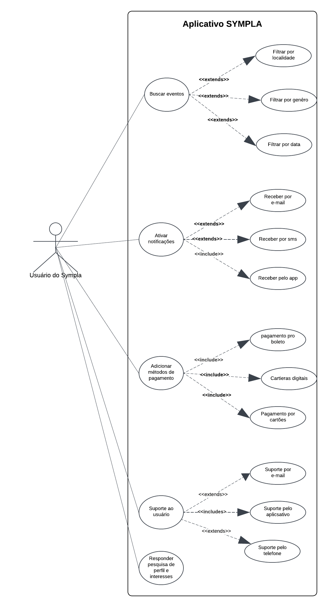

# Casos de Uso

## Introdução

Casos de uso são representações detalhadas que demonstram como o sistema será utilizado em contextos específicos. Eles destacam as interações entre os usuários e o sistema, enfatizando os passos necessários para atingir um objetivo particular.

Esses casos têm como finalidade apoiar o desenvolvimento do sistema, oferecendo uma visão clara de seus requisitos funcionais. Eles descrevem as ações que os usuários podem realizar e as respostas esperadas do sistema.

---

## Metodologia

O diagrama de caso de uso é uma ferramenta visual que representa as interações entre usuários e o sistema, evidenciando suas funcionalidades e comportamentos principais. Ele é composto por **atores**, que simbolizam os usuários, e **casos de uso**, que especificam as ações realizadas pelos atores e as respostas geradas pelo sistema.

Para criar os casos de uso, utilizamos a persona [João](https://requisitos-de-software.github.io/2024.2-Sympla/elicitacao/personas/), que nos ajudou a entender melhor as necessidades e expectativas dos usuários finais. Com base na persona [João](https://requisitos-de-software.github.io/2024.2-Sympla/elicitacao/personas/), foi possível criar cenários realistas para os diagramas de caso de uso, considerando os objetivos e perfis variados dos usuários. Na sequência, a Tabela 1 apresenta os elementos do diagrama:

<b>Tabela 1</b>: Elementos do diagrama de casos de uso

| Nome | Função | Elemento
|------|------|:-------:
| Ator | Representam os diferentes tipos de usuários externos que interagem com o sistema | <figure class="usecaseElement" style="width: 20%; display: flex;"></figure>
| Elipse (Caso de Uso) | É usada para representar os casos de uso no diagrama. Um caso de uso descreve uma funcionalidade ou uma ação específica que o sistema pode realizar em resposta às interações dos atores. A elipse contém o nome do caso de uso | <figure class="usecaseElement" style="width: 40%; display: flex;"></figure>
| Retângulo (Sistema) | Usado para representar o sistema ou o bloco em análise. Ele envolve os casos de uso e atores relacionados | <figure class="usecaseElement" style="width: 40%; display: flex;"></figure>
| Flecha (Relações) | As flechas são usadas para representar as relações ou interações entre atores e casos de uso | <figure class="usecaseElement" style="width: 40%; display: flex;"></figure>

<b>Autor: <a href="https://github.com/gxaite">Gabriel Scheidt</a></b>

Além disso, no diagrama de casos de uso é possível especificar:

- Os requisitos externos de um sistema, ou seja, as funcionalidades necessárias que o sistema deve oferecer para atender às necessidades dos usuários.
- As funcionalidades disponíveis no sistema, ou seja, o que o sistema é capaz de fazer para satisfazer as necessidades dos usuários.
- Os requisitos impostos pelo sistema ao ambiente em que está inserido, definindo como o sistema interage com o ambiente para realizar suas funções.

## Diagrama de Casos de Uso

A figura 1 demonstra o diagrama de casos de uso.

Figura 1: Casos de uso do app Sympla

<b>Autor: <a href="https://github.com/gxaite">Gabriel Scheidt</a></b>

## Especialização dos casos de uso

As tabelas de 2 a 6 mostram a especialização dos casos de uso.

Tabela 2: Buscar evento

| UC01 | Informações |
| ----- | ---------- |
| Descrição | O usuário é capaz de buscar eventos por diferentes filtros |
| Ator | Usuário |
| Pré-condições | Acesso à internet, acesso ao app |
| Ação | O usuário  encontra eventos |
| Fluxo principal | <ul><li> O usuário acessa o aplicativo   <ul><li> O usuário acessa "Buscar evento..."   <ul><li> O usuário filtra a busca por município, data, horário ou gênero do evento (categoria do evento)   |
| Fluxo alternativo | <ul><li> O usuário acessa o aplicativo   <ul><li> O app solicita a localização do usuário   <ul><li> O usuário seleciona "Sim"  |
| Fluxo de exceção | <ul><li> O usuário acessa o aplicativo  <ul><li> A localização do usuário está desligada  <ul><li> O usuário busca evento disponibilizado na página inicial   |
| Pós-condições | O usuário tem acesso a eventos que correspondem ao(s) filtro(s) de busca escolhido(s) |
| Data de Criação | 06/12/2024 |
| Rastreabilidade | [RF01](https://requisitos-de-software.github.io/2024.2-Sympla/elicitacao/requisitos/requisitos_elicitados/), [RF02](https://requisitos-de-software.github.io/2024.2-Sympla/elicitacao/requisitos/requisitos_elicitados/), [RF26](https://requisitos-de-software.github.io/2024.2-Sympla/elicitacao/requisitos/requisitos_elicitados/) |

<b>Autor: <a href="https://github.com/gxaite">Gabriel Scheidt</a></b>

Tabela 3: Ativar notificações sobre eventos 

| UC02 | Informações |
| ----- | ---------- |
| Descrição | O usuário é capaz de ativar as notificações sobre os eventos que deseja. |
| Ator | Usuário |
| Pré-condições | Acesso à internet, acesso ao app |
| Ação | O usuário ativa as notificações no aplicativo |
| Fluxo principal | <ul><li> O usuário acessa o aplicativo   <ul><li> O usuário acessa a aba de notificações em "Meu Painel" e acessa as configurações   <ul><li> O usuário ativa a opção de "Ativar notificações" dentro do app.
| Fluxo alternativo | <ul><li> O usuário abre o app em seu primeiro acesso   <ul><li> O app pergunta se o usuário deseja ativar as notificações   <ul><li>Usuário seleciona a opção "sim" e as notificações são ativadas |
| Fluxo de exceção | <ul><li>O usuário abre o app   <ul><li> O usuário tem uma tela com as notificações não lidas  |
| Pós-condições | O usuário agora está com as notificações ligadas e será notificado sobre novos eventos |
| Data de Criação | 06/12/2024 |
| Rastreabilidade | [RF03](https://requisitos-de-software.github.io/2024.2-Sympla/elicitacao/requisitos/requisitos_elicitados/) |

<b>Autor: <a href="https://github.com/rafgpereira">Rafael Pereira</a></b>

Tabela 4: Adicionar método de pagamento

| UC03 | Informações |
| ----- | ---------- |
| Descrição | Usuário conecta carteira digital, adiciona outro método de pagamento no app ou paga direto por meio de um boleto. |
| Ator | Usuário |
| Pré-condições |<ul><li>Acesso à internet</li><li>Conta no app</li><li>Conta válida em uma carteira digital ou um cartão de crédito/débito</li>|
| Ação | O usuário cadastra uma nova forma de pagamento ou opta pelo pagamento via boleto bancário | 
| Fluxo principal | <ul><li>O usuário acessa o aplicativo Sympla e faz login em sua conta. <ul><li>O usuário navega até as configurações de pagamento ou opções de pagamento. <li>O usuário seleciona a opção para adicionar uma carteira digital e escolhe a opção correspondente à sua carteira digital ou escolhe poder adicionar algum cartão de crédito/débito válido. <ul><li>O usuário insere as informações solicitadas, o aplicativo valida e verifica a autenticidade do método de pagamento, confirmando a vinculação ao app. </ul> |
| Fluxo alternativo | <ul><li>O usuário acessa o aplicativo <ul><li>Durante o processo de criação da conta, o usuário é solicitado a fornecer informações adicionais, incluindo os dados de sua carteira digital ou opções de cartão. <ul><li>O usuário insere as informações da carteira digital ou do cartão e conclui o processo de criação da conta. </ul> |
| Fluxo de exceção | <ul><li>A lista de métodos de pagamento suportados está vazia ou não é exibida corretamente.</li><li>O aplicativo exibe uma mensagem de erro informando que não foi possível carregar os métodos de pagamento suportados e sugere:<ul><li>Tentar novamente mais tarde.</li><li>Entrar em contato com o suporte ao cliente para obter assistência.</li></ul></li></ul> |
| Pós-condições | O usuário pode pagar pelos ingressos utilizando um método de pagamento configurado (cartão, carteira digital ou boleto).|
| Data de Criação | 06/12/2024 |
| Rastreabilidade | [RF23](https://requisitos-de-software.github.io/2024.2-Sympla/elicitacao/requisitos/requisitos_elicitados/), [RF31](https://requisitos-de-software.github.io/2024.2-Sympla/elicitacao/requisitos/requisitos_elicitados/)  |

<b>Autor: <a href="https://github.com/VHbernardes">Victor Hugo</a></b>

Tabela 5: Suporte ao usuário 

| UC04 | Informações |
| ----- | ---------- |
| Descrição | O usuário deve poder acessar o suporte ao cliente por meio de um chat no aplicativo, enviar um e-mail ou SMS para obter ajuda. |
| Ator | Usuário |
| Pré-condições | Possuir uma conta cadastrada, acesso à internet e acesso ao Sympla. |
| Ação | O usuário escolhe o método desejado para contatar o suporte ao cliente e solicita assistência. |
| Fluxo principal | <ul><li>O usuário acessa o Sympla e faz login.<ul><li> O usuário navega até a seção de "Conversar no chat" no menu do app ou na versão web, navega até a seção "Central de ajuda". <ul><li> O sistema abre uma janela de chat e conecta o usuário com um bot/atendente ou abre um guia com várias dúvidas frequentes, onde vocẽ pode buscar quaisquer dúvidas ou se conectar a um chat.<ul><li>O usuário conversa com o atendente ou encontra a sua dúvida e resolve sua questão. |
| Fluxo alternativo | <ul><li>O usuário acessa o app Sympla e faz login. <ul><li>O usuário navega até encontrar uma outra forma de contato. <ul><li>O Usuário encontra o email e decide enviar a mensagem, podendo detalhar mais as suas dúvidas.<ul><li>O usuário recebe um email de volta dos atendentes do Sympla e resolve sua questão. |
| Fluxo de exceção | <ul><li>O usuário tenta acessar o "Chat com Suporte", mas a opção está fora do ar.<ul><li>O sistema exibe uma mensagem informando o problema e sugere o envio de um e-mail ou SMS como alternativas. |
| Pós-condições | O usuário obtém assistência por meio do suporte escolhido e resolve sua questão. |
| Data de Criação | 06/12/2024 |
| Rastreabilidade | [RF20](https://requisitos-de-software.github.io/2024.2-Sympla/elicitacao/requisitos/requisitos_elicitados/) |

<b>Autor: <a href="https://github.com/MilenaFRocha">Milena Rocha</a></b>

Tabela 6: Pesquisa de perfil e interesses 

| UC05 | Informações |
| ----- | ---------- |
| Descrição | O usuário deve poder responder a uma pesquisa de perfil sobre seus gostos para eventos. |
| Ator | Usuário |
| Pré-condições | Possuir uma conta cadastrada e acesso à internet. |
| Ação | O usuário ira responder à pesquisa de perfil e gostos de acordo as opções de eventos ofertadas pelo app. |
| Fluxo principal | <ul><li>O usuário efetua cadastro no app<ul><li> Aparece uma mensagem sobre a pesquisa de perfil e se deseja responder <ul><li>Usuário seleciona a opção "sim" <ul><li> Usuário responde à pesquisa |
| Fluxo alternativo | <ul><li>O usuário efetua cadastro no app <ul><li>Aparece uma caixa de mensagem sobre a pesquisa de perfil <ul><li>Usuário sem querer pula a pesquisa de perfil selecionando a opção de "Responder mais tarde" <ul><li>O usuário abre o "Meu Painel" e responde a pesquisa que estará localizada ali. |
| Fluxo de exceção | <ul><li>O usuário efetua cadastro no app<ul><li> Aparece uma caixa de mensagem sobre a pesquisa de perfil e se deseja responder <ul><li>Usuário rejeita responder a pesquisa |
| Pós-condições | O usuário terá em sua tela principal somente eventos que sejam de seu interesse |
| Data de Criação |06/12/2024 |
| Rastreabilidade | [RF35](https://requisitos-de-software.github.io/2024.2-Sympla/elicitacao/requisitos/requisitos_elicitados/) |

<b>Autor: <a href="https://github.com/renantfm4">Renan Araújo</a></b>

## Bibliografia

> Lucidchart. Diagrama de Caso de Uso UML. Disponível em: <<https://www.lucidchart.com/pages/pt/diagrama-de-caso-de-uso-uml>>. Acesso em: 12 novembro 2024.

> BARBOSA, S. D. J.; SILVA, B. S. Interação Humano-Computador. Rio de Janeiro: Elsevier, 2011.

>Caso de Uso. Repositório da disciplina de Requisitos de Software da Universidade de Brasília, 2023. Disponível em: [https://requisitos-de-software.github.io/2023.1-BilheteriaDigital/modelagem/useCase/](https://requisitos-de-software.github.io/2023.1-BilheteriaDigital/modelagem/useCase/). Acesso em: 12 nov. 2024.

## Histórico de Versões

| Versão |          Descrição              |     Autor      |      Data      |   Revisor     |
|:------:|:-------------------------------:|:--------------:|:--------------:|:-------------:|
|  1.0   | Criação do documento | [Gabriel Scheidt](https://github.com/Gxaite)  | 06/12/2024   | [MilenaFRocha](https://github.com/MilenaFRocha) |