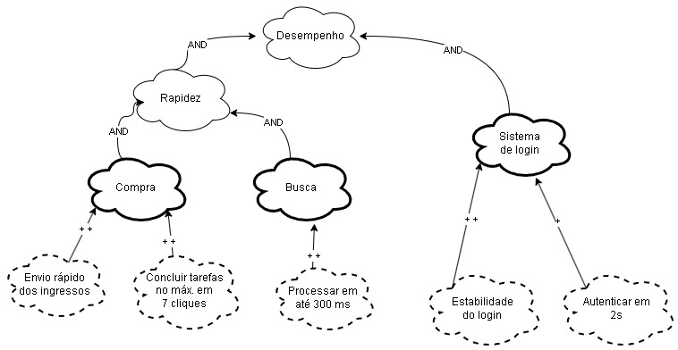
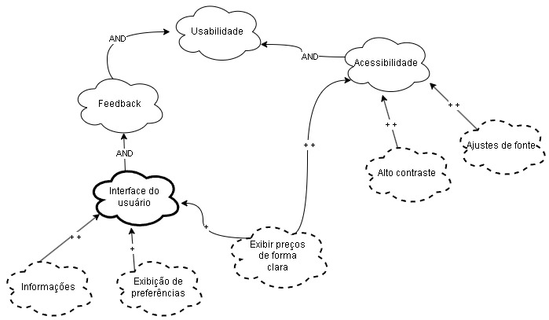
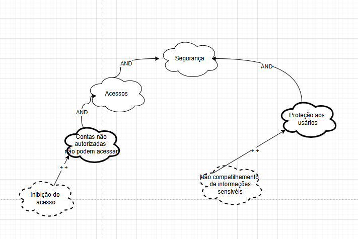

## Introdução

Uma abordagem para representar e analisar *Requisitos Não-Funcionais (RNFs)* é o NFR Framework, que tem como objetivo implementar soluções específicas. Esse método leva em consideração as características gerais do sistema e de seu domínio. No contexto do NFR Framework, utiliza-se o modelo *Softgoal Interdependency Graph (SIG)*.

## Softgoal Interdependency Graph

O *Softgoal Interdependency Graph (SIG)* é uma ferramenta visual que ilustra como o NFR Framework opera. Ele apresenta, de forma gráfica e clara, as decisões tomadas pela equipe de desenvolvimento em relação aos softgoals e destaca as interdependências entre eles<a id="anchor_1" href="#REF1">1</a>.

### Tipos de Softgoal

Para entender o *Softgoal Interdependency Graph (SIG), é fundamental compreender o conceito de  NFR Softgoal. Um *softgoal refere-se a um objetivo que não possui definição precisa e cujos critérios de satisfação são vagos. Em outras palavras, trata-se de uma característica abstrata que pode ser analisada e avaliada posteriormente para determinar seu cumprimento. 

Os softgoals podem ser de diferentes tipos. Quando são *operacionalizados, assumem uma forma concreta, transformando-se em funcionalidades claras. Já os  softgoals de afirmação* são descritos em linguagem natural, servindo como registros adicionais e argumentativos que podem ser incorporados ao modelo. A Figura 1 ilustra os diferentes tipos de softgoals<a id="anchor_1" href="#REF1">1</a>.

<b>Figura 1</b> - Tipos de Softgoal

 Fonte: (SILVA, 2019)

## Interdependências  
As interdependências representam as relações entre softgoals, que podem ser classificadas em decomposições e contribuições.

<b>Figura 2</b> - Tipos de Softgoal

 Fonte: (SILVA, 2019)

### Decomposições  
As decomposições descrevem como um softgoal pode ser subdividido em outros, podendo ocorrer em diferentes níveis de abstração:  
1.  Softgoals de NFR (Requisitos Não Funcionais)   
2.  Softgoals de Operacionalização   
3.  Softgoals de Afirmação 

De acordo com SILVA (2019), as decomposições ajudam a detalhar os softgoals em elementos mais específicos, reduzindo ambiguidades e facilitando a priorização. Os principais tipos são:  

-  Decomposição NFR:  Divide questões fundamentais em partes menores, auxiliando na priorização e clareza.  
-  Decomposição de Operacionalização:  Refina soluções amplas em alternativas mais específicas.  
-  Decomposição de Afirmação:  Fornece justificativas ou contraposições para decisões específicas.  
-  Decomposição de Priorização:  Um softgoal é refinado para outro do mesmo tipo e tópico, atribuindo uma prioridade específica.  

### Contribuições  
No  NFR Framework , as especializações de softgoals podem contribuir de maneira variada para outros softgoals: positiva ou negativa, total ou parcial. Os tipos de contribuições incluem:  

-  AND:  Todos os softgoals derivados devem ser satisfeitos para que o softgoal principal também seja.  
-  OR:  Basta que um dos softgoals derivados seja satisfeito para que o principal também o seja.  
-  MAKE (++):  Uma contribuição totalmente positiva, garantindo a satisfação do softgoal original.  
-  BREAK (--):  Uma contribuição totalmente negativa, levando à negação do softgoal original.  
-  HELP (+):  Contribuição parcialmente positiva, refletindo positivamente no softgoal original.  
-  HURT (-):  Contribuição parcialmente negativa, impactando de forma negativa o softgoal original.  
-  UNKNOWN (?):  Relação incerta ou indefinida.  
-  EQUALS:  Indica que as satisfações do softgoal derivado e do principal são idênticas.  
-  SOME:  A contribuição é conhecida, mas sua intensidade é desconhecida.  

### Propagação de Impactos  
A propagação de impactos no  NFR Framework  considera como mudanças em um requisito não funcional podem afetar outros requisitos relacionados. Para isso, é essencial identificar dependências e compreender as interações entre os requisitos, avaliando prioridades e possíveis compromissos (trade-offs).  

As diferentes formas de impacto são:  
-  ✓ (Satisfeito):  O requisito contribui positivamente para outro.  
-  𝒲+ (Fracamente satisfeito):  A relação é positiva, mas menos intensa.  
-  X (Negado):  O requisito impacta negativamente outro, impossibilitando sua realização.  
-  𝒲- (Fracamente negado):  Relação negativa, mas com menor intensidade.  
-  🗲 (Conflitante):  Existe conflito, com impactos positivos e negativos simultâneos.  
-  u (Indeterminado):  Relação desconhecida devido à falta de informações.  

Compreender essas interdependências e seus impactos é crucial para tomar decisões informadas e gerenciar os efeitos colaterais de mudanças nos requisitos.

## Metodologia

Neste documento, serão apresentados 3 NFRs, com requisitos vindo dos [requisitos elicitados não funcionais](https://requisitos-de-software.github.io/2024.2-Sympla/elicitacao/requisitos/requisitos_elicitados/). Para cada categoria, foi feito um SIG (Softgoal Interdependency Graph), um diagrama da propagação de impactos e um cartão de especificação, que possui informações sobre o NFR, como a descrição, a categoria, os conflitos, a origem, os critérios e outras informações. 

O usuário Daniel Ferreira concordou em disponibilizar sua imagem e voz para uso durante o aprendizado de requisitos, conforme descrito no [termo de voz e imagem](../assets/termo_daniel.pdf), preenchendo as linhas relativas às "prioridades".
### Cronograma

Na Tabela 1 são listadas as informações técnicas da validação.

<b>Tabela 1</b>: Cronograma de entrevista

| **Data**  | **Hora** | **Mediador** | **Usuário** | **Duração** | **Local**                  |
|------------|-------|--------------------|------------------|-------------|---------------------------|
| 16/12/2024 | 12:00 | [Milena Rocha](https://github.com/MilenaFRocha)        | Daniel Ferreira   | 05:00      | Presencial (UnB - Campus Gama) |

### Validação

<iframe width="560" height="315" src="https://www.youtube.com/embed/Sya6XIja7y8?si=tLEiCk5PXCrSrtBj" title="YouTube video player" frameborder="0" allow="accelerometer; autoplay; clipboard-write; encrypted-media; gyroscope; picture-in-picture; web-share" referrerpolicy="strict-origin-when-cross-origin" allowfullscreen></iframe>

<b>Fonte:</b> Milena Rocha.Validação do NFR com o usuário Daniel, 2024/2, UnB. 2024. Disponível em: <a href="https://www.youtube.com/watch?v=Sya6XIja7y8">https://youtu.be/Sya6XIja7y8</a>. Acesso em: 16 dez. 2024.

## NFR 01 - Desempenho

<b>Figura 3</b> - SIG Desempenho

 Fonte: [Victor Hugo](https://github.com/VHbernardes) e [Milena Rocha](https://github.com/MilenaFRocha)

#### Cartão de Especificação - Desempenho

<b>Tabela 2</b> - Cartão de Especificação - Desempenho

| **ID do NFR (NFR01)** | **Classificação:** Desempenho |
|------------------------|------------------------------|
| **Descrição:**         | Refere-se à capacidade do sistema de processar compras de ingressos rapidamente, sem atrasos perceptíveis. |
| **Justificativa:**     | Um sistema de alto desempenho garante uma melhor experiência para o usuário, reduzindo frustrações com lentidão ou atrasos. |
| **Origem dos Requisitos:** | Os requisitos [RNF01](../elicitacao/requisitos/requisitos_elicitados.md), [RNF04](#) e [RNF05](#). |
| **Dependências:**      | RNF04 depende de RNF01 para envio rápido de ingressos. |
| **Prioridade:**        | Alta |
| **Conflitos:**         | Nenhum |

#### Propagação dos Impactos - Desempenho

A seguir, temos a avaliação da propagação dos impactos relativa à Figura 4.

<b>Tabela 3</b> - Impactos Desempenho

| NFR | Impacto | Avaliador |
|-----|---------|-------|
|Desempenho|  𝒲-| [Milena Rocha](https://github.com/MilenaFRocha)|
|Rapidez |  𝒲+|  [Milena Rocha](https://github.com/MilenaFRocha)|
|Compra| 𝒲-|[Milena Rocha](https://github.com/MilenaFRocha)|
|Envio rápido dos ingressos| 𝒲-|[Milena Rocha](https://github.com/MilenaFRocha)|
|Concluir tarefas com no máx. 7 cliques| 𝒲+|[Milena Rocha](https://github.com/MilenaFRocha)|
|Busca| 𝒲+|[Milena Rocha](https://github.com/MilenaFRocha)|
|Processar em até 300 ms| 𝒲+|[Milena Rocha](https://github.com/MilenaFRocha)|
|Sistema de login| 𝒲+|[Milena Rocha](https://github.com/MilenaFRocha)|
|Estabilidade do login| 𝒲-|[Milena Rocha](https://github.com/MilenaFRocha)|
|Autenticar em até 2s| ✓|[Milena Rocha](https://github.com/MilenaFRocha)|

Fonte: [Milena Rocha](https://github.com/MilenaFRocha) 

## NFR 02 - Usabilidade

<b>Figura 4</b> - SIG Usabilidade

 Fonte: [Victor Hugo](https://github.com/VHbernardes)

#### Cartão de especificaçao

<b>Tabela 4</b> - Cartão de Especificação 2

| **ID do NFR (NFR02)** | **Classificação:** Usabilidade |
|------------------------|------------------------------|
| **Descrição:**         | Refere-se à facilidade de uso e navegação intuitiva no sistema, permitindo acesso eficiente a funcionalidades como busca de eventos, filtros e informações sobre ingressos. |
| **Justificativa:**     | A usabilidade aprimora a interação do usuário com o sistema, aumentando sua satisfação e reduzindo erros. |
| **Origem dos Requisitos:** | Os requisitos [RNF03](#), [RNF07](#), [RNF08](#), [RNF09](#), [RNF10](#), [RNF12](#), [RNF13](#), [RNF14](#), [RNF15](#) e [RNF17](#). |
| **Dependências:**      | RNF07 depende de RNF12; RNF08 interage com RNF13; RNF15 complementa RNF14. |
| **Prioridade:**        | Alta |
| **Conflitos:**         | Nenhum |

#### Propagação dos Impactos - Usabilidade

A seguir, temos a avaliação da propagação dos impactos relativa à Figura 3.

<b>Tabela 5</b> - Impactos Usabilidade

| NFR | Impacto | Avaliador |
|-----|---------|-------|
|Usabilidade|  𝒲-| [Victor Hugo](https://github.com/VHbernardes)|
|Feedback |  𝒲+|  [Victor Hugo](https://github.com/VHbernardes)|
|Interface do Usuário| 𝒲-|[Victor Hugo](https://github.com/VHbernardes)|
|Sistema| 𝒲-|[Victor Hugo](https://github.com/VHbernardes)|
|Informações| ✓|[Victor Hugo](https://github.com/VHbernardes)|
|Exibição de preferências| ✓ |[Victor Hugo](https://github.com/VHbernardes)|
|Exibir preços de forma clara| 𝒲-|[Victor Hugo](https://github.com/VHbernardes)|
|Envio rápido dos ingressos| 𝒲+|[Victor Hugo](https://github.com/VHbernardes)|
|Concluir tarefas com no máx. 7 cliques| 𝒲+|[Victor Hugo](https://github.com/VHbernardes)|
|Estabilidade do login| 𝒲-|[Victor Hugo](https://github.com/VHbernardes)|
|Acessibilidade| ✓|[Victor Hugo](https://github.com/VHbernardes)|
|Alto contraste| ✓|[Victor Hugo](https://github.com/VHbernardes)|
|Ajustes de fontes| ✓ |[Victor Hugo](https://github.com/VHbernardes)|

Fonte: [Victor Hugo](https://github.com/VHbernardes)

## NFR 03 - Segurança

<b>Figura 5</b> - SIG Segurança

 Fonte: [Victor Hugo](https://github.com/VHbernardes)

#### Cartão de especificaçao

<b>Tabela 6</b> - Cartão de Especificação 3

| **ID do NFR (NFR03)** | **Classificação:** Segurança |
|------------------------|------------------------------|
| **Descrição:**         | Garante a proteção dos dados do usuário, incluindo informações sensíveis, através de autenticação segura e mecanismos de segurança robustos. |
| **Justificativa:**     | Segurança é essencial para proteger os usuários contra acessos não autorizados e garantir a integridade das transações. |
| **Origem dos Requisitos:** | Os requisitos [RNF02](#), [RNF11](#) e [RNF18](#). |
| **Dependências:**      | RNF02 depende de RNF18; RNF11 complementa RNF18. |
| **Prioridade:**        | Alta |
| **Conflitos:**         | Nenhum |

#### Propagação dos Impactos - Segurança

A seguir, temos a avaliação da propagação dos impactos relativa à **Segurança**.  

  

**Tabela 7** - Impactos Segurança  

| **NFR**               | **Impacto** | **Avaliador**                           |  
|------------------------|-------------|-----------------------------------------|  
| Segurança             | 𝒲-          | [Victor Hugo](https://github.com/VHbernardes) |  
| Autenticação segura    | ✓           | [Victor Hugo](https://github.com/VHbernardes) |  
| Proteção contra ataques de força bruta | ✓ | [Victor Hugo](https://github.com/VHbernardes) |  
| Criptografia de dados  | ✓           | [Victor Hugo](https://github.com/VHbernardes) |  
| Backup e recuperação   | ✓           | [Victor Hugo](https://github.com/VHbernardes) |  
| Controle de acessos    | ✓           | [Victor Hugo](https://github.com/VHbernardes) |  
| Logs de segurança      | ✓           | [Victor Hugo](https://github.com/VHbernardes) |  
| Monitoramento contínuo | ✓           | [Victor Hugo](https://github.com/VHbernardes) |  
| Atualizações de segurança | ✓       | [Victor Hugo](https://github.com/VHbernardes) |  
| Compatibilidade com GDPR ou LGPD | ✓  | [Victor Hugo](https://github.com/VHbernardes) |  
| Autenticação multifator (MFA) | ✓     | [Victor Hugo](https://github.com/VHbernardes) |  

  

## NFR 04 - Suportabilidade

<b>Figura 6</b> - SIG Usabilidade

 Fonte: [Victor Hugo](https://github.com/VHbernardes)

#### Cartão de especificaçao

<b>Tabela 8</b> - Cartão de Especificação 4

| **ID do NFR (NFR04)** | **Classificação:** Suportabilidade |
|------------------------|------------------------------|
| **Descrição:**         | Refere-se à capacidade do sistema de fornecer suporte eficiente, incluindo relatórios de erros e atendimento para públicos específicos. |
| **Justificativa:**     | Um bom suporte melhora a confiabilidade do sistema e atende a uma variedade de usuários, incluindo idosos e pessoas com deficiência. |
| **Origem dos Requisitos:** | Os requisitos [RNF06](#), [RNF16](#) e [RNF19](#). |
| **Dependências:**      | RNF19 apoia RNF16 na oferta de suporte especializado. |
| **Prioridade:**        | Média |
| **Conflitos:**         | Nenhum |

#### Propagação dos Impactos - Suportabilidade

A seguir, temos a avaliação da propagação dos impactos relativa à Figura 5.

<b>Tabela 9</b> - Impactos Suportabilidade

| NFR | Impacto | Avaliador |
|-----|---------|-------|
|Suportabilidade|  𝒲-| [Victor Hugo](https://github.com/VHbernardes)|
|Dispositivos móveis |  ✓|  [Victor Hugo](https://github.com/VHbernardes)|
|Android| ✓|[Victor Hugo](https://github.com/VHbernardes)|
|Disponibilidade na Play store| ✓|[Victor Hugo](https://github.com/VHbernardes)|
|Ser compatível com Android 4.2 ou superior| ✓|[Victor Hugo](https://github.com/VHbernardes)|
|IOS| ✓|[Victor Hugo](https://github.com/VHbernardes)|
|Disponibilidade na App store| ✓|[Victor Hugo](https://github.com/VHbernardes)|
|Ser compatível com IOS 9.0 ou superior| ✓|[Victor Hugo](https://github.com/VHbernardes)|
|Versao Web| ✓|[Victor Hugo](https://github.com/VHbernardes)|
|Acessibilidade Global| ✓|[Victor Hugo](https://github.com/VHbernardes)|
|Idioma| ✓|[Victor Hugo](https://github.com/VHbernardes)|
|Portugues| ✓|[Victor Hugo](https://github.com/VHbernardes)|
|Ingles| ✓|[Victor Hugo](https://github.com/VHbernardes)|
|Espanhol| ✓|[Victor Hugo](https://github.com/VHbernardes)|

Fonte: [Victor Hugo](https://github.com/VHbernardes)

## Referências Bibliográficas

> <a id="REF1" href="#anchor_1">1.</a> SILVA, Reinaldo Antônio. NFR4ES: Um Catálogo de Requisitos Não-Funcionais para Sistemas Embarcados. Centro de Informática UFPE, Recife, 2019. Disponível em: <https://repositorio.ufpe.br/handle/123456789/34150>. Acesso em: 22/05/2023.

## **Bibliografia**

> SERRANO, Milene. Requisitos – Aula 17. 2017. Apresentação de slides. Disponível em: [https://aprender3.unb.br/pluginfile.php/2972516/mod_resource/content/1/Requisitos%20-%20Aula%20019a.pdf](https://aprender3.unb.br/pluginfile.php/2972516/mod_resource/content/1/Requisitos%20-%20Aula%20019a.pdf). Acesso em: 16 de Dez. 2024.

> NFR Framework. Repositório da disciplina de Requisitos de Software da Universidade de Brasília, 2023. Disponível em: [https://requisitos-de-software.github.io/2023.1-BilheteriaDigital/modelagem/agil/nfrframework/](https://requisitos-de-software.github.io/2023.1-BilheteriaDigital/modelagem/agil/nfrframework/). Acesso em: 16 de Dez. 2024.

## Histórico de Versões

| Versão |          Descrição              |     Autor      |      Data      |   Revisor     | 
|:------:|:-------------------------------:|:--------------:|:--------------:|:-------------:|
|  1.0   | Criação desse documento | [Milena Rocha](https://github.com/MilenaFRocha) | 12/12/2024 | [Rafael Pereira](https://github.com/rafgpereira)  |
|  1.1   | Adição dos diagramas, cartão e propagação do NFR | [Victor Hugo](https://github.com/VHbernardes) | 16/12/2024 | [Milena Rocha](https://github.com/MilenaFRocha)  |
|  1.2   | Adição da metodologia | [Milena Rocha](https://github.com/MilenaFRocha)| 16/12/2024 | [Victor Hugo](https://github.com/VHbernardes)   |
|  1.3   | Upload da validação  | [Milena Rocha](https://github.com/MilenaFRocha)| 16/12/2024 | [Victor Hugo](https://github.com/VHbernardes)   |