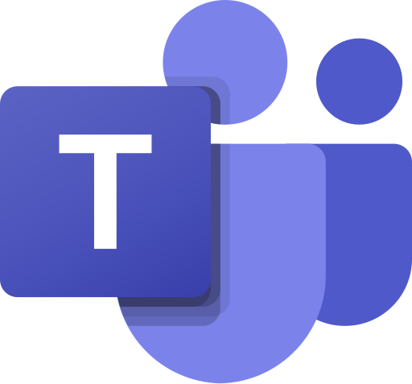
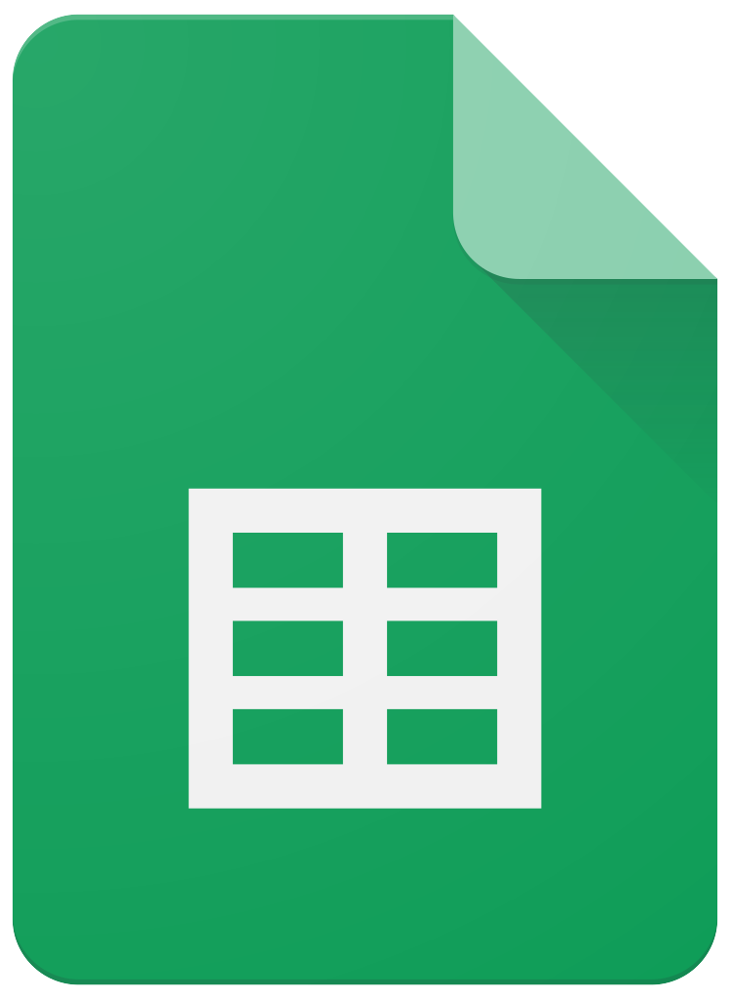
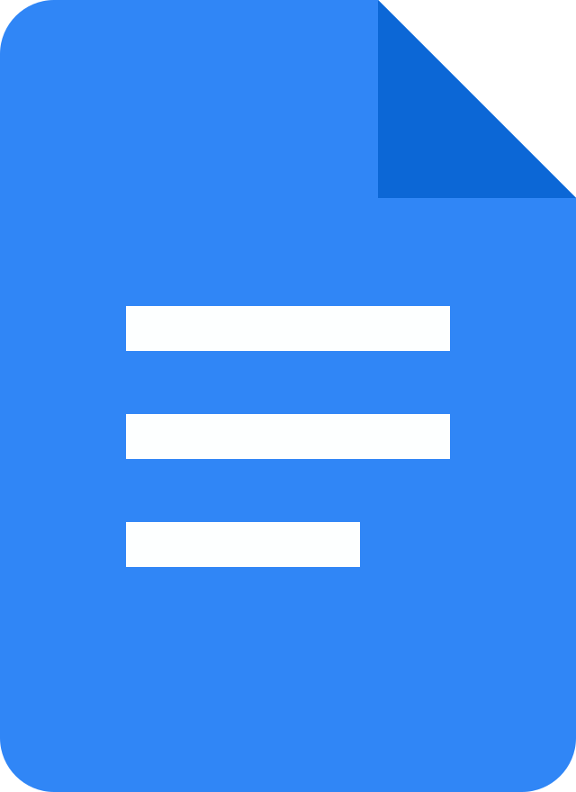

# Ferramentas 

## **Introdução**

Para facilitar o gerenciamento e o desenvolvimento da documentação do projeto da disciplina, foram selecionadas algumas ferramentas para ajudar nesse auxilio, elas estão apresentadas na Tabela 1. 

Tabela 1: Ferramentas 

| Logo | Ferramenta | Finalidade |
| :-----: | :----: | ----------- |
|  | <a id="b" href="#b">Github</a> | Plataforma para armazenar os documentos produzidos e versionamento deles |
|  | <a id="a" href="#a">MkDocs</a> | Ferramenta utilizada para a criação da documentação do projeto |
|  | <a id="d" href="#d">Teams</a> | Plataforma usada para fazer as reuniões e também para gravá-las |
|  | <a id="e" href="#e">Whatsapp</a> | Principal meio de comunicação entre a equipe.|
|  | <a id="f" href="#f">Canva</a> | Utilizado para criação do Rich picture |
|  | <a id="g" href="#g">Visual Studio Code</a> | IDE usada para edição dos arquivos de documentação |
|  | <a id="g" href="#g">Planilhas</a> | Ferramenta usada para montar os horários |
|  | <a id="g" href="#g">Docs</a> | Ferramenta usada para criação de arquivos  |
|  | <a id="g" href="#g">Youtube</a> | Plataforma para hospedar os vídeos  |

## **Bibliografia**

> <a id="FRM1" href="#anchor_1">1.</a> GitHub. Disponível em: [https://docs.github.com/pt](). Acesso em: 27 de out. de 2024.
>
> <a id="FRM4" href="#anchor_2">2.</a> MkDocs. Disponível em: [https://www.mkdocs.org/](). Acesso em: 27 de out. de 2024.
> 
> <a id="FRM2" href="#anchor_3">3.</a> Microsoft Teams. Disponível em: [https://www.microsoft.com/pt-br/microsoft-teams/log-in](). Acesso em: 27 de out. de 2024.
>
> <a id="FRM6" href="#anchor_4">4.</a> WhatsApp. Disponível em: [https://www.whatsapp.com/?lang=pt_br](). Acesso em: 27 de out. de 2024.
>
> <a id="FRM6" href="#anchor_5">5.</a> Canva. Disponível em: [https://www.canva.com/](). Acesso em: 27 de out. de 2024.
> 
> <a id="FRM5" href="#anchor_6">6.</a> Visual Studio Code. Disponível em: [https://code.visualstudio.com/](). Acesso em: 27 de out. de 2024.
>
> <a id="FRM8" href="#anchor_7">7.</a> Google Planilhas. Disponível em: [https://www.google.com/intl/pt-BR/sheets/about/](). Acesso em: 27 de out. de 2024.
>
> <a id="FRM9" href="#anchor_8">8.</a> Google Docs. Disponível em: [https://www.google.com/intl/pt-BR/docs/about/](). Acesso em: 27 de out. de 2024.
> 
> <a id="FRM7" href="#anchor_9">9.</a> YouTube. Disponível em: [https://about.youtube/](). Acesso em: 27 de out. de 2024.
>

#### **Histórico de Versões**

| Versão |          Descrição              |     Autor      |      Data      |   Revisor     |    Data de revisão    |  
|:------:|:-------------------------------:|:--------------:|:--------------:|:-------------:|:---------------------:|
|  1.0   | Inicío e Adição das ferramentas | Renan Araújo | 27/10/2024   | Gabriel Scheidt  ||
