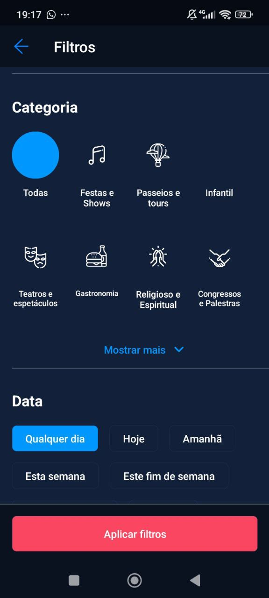

## Introdução

Este documento expoem a utilização do método de rastreabilidade forward-from. A rastreabilidade de requisitos é uma prática essencial no desenvolvimento de sistemas, pois facilita a identificação e a conexão dos requisitos não apenas durante a fase de desenvolvimento, mas ao longo de todo o ciclo de vida do sistema. Essa abordagem resulta em uma compreensão mais aprofundada das origens e das consequências de cada requisito, o que, por sua vez, contribui para a garantia da qualidade, uma gestão eficiente de mudanças e o alinhamento contínuo com as demandas do cliente.

## Metodologia

A metodologia adotada baseia-se no uso de uma matriz de rastreabilidade, aplicada aos requisitos levantados e aos artefatos desenvolvidos após o processo de elicitação nas etapas de modelagem de requisitos e ágil. A relação entre um requisito e um tipo de artefato não segue um padrão de correspondência direta, como um para um; por exemplo, um único requisito pode estar associado a mais de um caso de uso. A tabela 1 mostra a matriz de rastreabilidade, onde as linhas representam os requisitos e as colunas correspondem aos artefatos gerados a partir desses requisitos. Os requisitos podem estar vinculados a diferentes elementos, como épicos, temas, histórias de usuário, léxicos, casos de uso, cenários, especificações suplementares e o NFR Framework. Esses elementos são representados nas colunas da matriz e preenchidos com o ID ou nome do artefato correspondente.

Para realizar a rastreabilidade dos elos, utilizamos o meta-modelo proposto por Toranzo. Esse meta-modelo organiza os requisitos levantados pelo grupo em diferentes níveis e elos. Conforme apresentado no slide 19 da aula 26 da professora Milene Serrano [1], os níveis são:

- **_Ambiental_**: Essas informações provêm do ambiente e contexto nos quais a organização está inserida.
- **_Organizacional_**: São dados relacionados à própria organização.
- **_Gerencial_**: Engloba informações que auxiliam na gestão do projeto.
- **_Desenvolvimento_**: Refere-se às informações associadas aos diversos artefatos gerados durante o processo de desenvolvimento.

Com base no slide 21 da [aula 26](https://aprender3.unb.br/pluginfile.php/2972560/mod_resource/content/1/Requisitos%20-%20Aula%20026.pdf) da professora Milene Serrano [2], os principais **elos de rastreabilidade** são os seguintes:

1. **Satisfação**: Indica que a classe de origem depende da satisfação proporcionada pela classe de destino.
2. **Recurso**: Reflete a dependência de recursos da classe de origem em relação à classe de destino.
3. **Responsabilidade**: Registra a participação, responsabilidade e ação de pessoas sobre os artefatos.
4. **Representação**: Captura a forma como os requisitos são representados ou modelados em outras linguagens.
5. **Alocado**: Relaciona a classe de origem a uma classe de destino que representa um subsistema.
6. **Agregação**: Indica a "composição" de elementos.

Para auxiliar na criação do meta-modelo de Toranzo, foram elaboradas as tabelas 1 e 2 a seguir.

## Matriz de rastreabilidade Forward-From

As tabelas 1 e 2 representam as matrizes de rastreabilidade em que as linhas representam os requisitos e cada coluna representa o artefato criado a partir do requisito.

**Legenda:**

> - RF: Requisito Funcional
> - RNF: Requisito Não Funcional
> - EP: Épico
> - T: Tema
> - HS: História de usuário
> - LEX - Léxico
> - UC - Caso de Uso
> - CEN - Cenário
> - F, U, R, P, S, + - Especificação de Uso
> - NFR - NFR Framework

### Requisitos funcionais
A tabela 1 abaixo mostra nossa matriz de rastreabilidade dos requisitos funcionais.

??? abstract "Tabela 1: Matriz de rastreabilidade Forward-from - Requisitos Funcionais"

    

    
Tabela 1: Matriz de rastreabilidade Forward-from - Requisitos Funcionais
    

    | Requisito / Versão | Tipo | Implementado | Épico | Tema | História de usuário | Léxico | Caso de Uso | Cenário |
    |-----------|------|--------------|-------|------|----------------------|--------|-------------|---------|
    | [RF01 / V.1.5](https://requisitos-de-software.github.io/2024.2-Sympla/elicitacao/requisitos/requisitos_elicitados/#requisitos)    | RF   | Sim          | [EP01](https://requisitos-de-software.github.io/2024.2-Sympla/modelagem/backlog/#epico-1-classificacao) | [T01](https://requisitos-de-software.github.io/2024.2-Sympla/modelagem/backlog/#temas) | [HS01](https://requisitos-de-software.github.io/2024.2-Sympla/modelagem/historias_usuario/#us01-filtrar-eventos-por-estado-e-municipio) | [LEX01](https://requisitos-de-software.github.io/2024.2-Sympla/modelagem/lexico/#l01-filtrar-eventos) | [UC01](https://requisitos-de-software.github.io/2024.2-Sympla/modelagem/casos_de_uso/#caso-1) | [CEN04](https://requisitos-de-software.github.io/2024.2-Sympla/modelagem/cenarios/#cenario-4-pesquisa-de-evento-filtrando-por-municipio-ou-estado) |
    | [RF02 / V.1.5](https://requisitos-de-software.github.io/2024.2-Sympla/elicitacao/requisitos/requisitos_elicitados/#requisitos)     | RF   | Sim          | [EP05](https://requisitos-de-software.github.io/2024.2-Sympla/modelagem/backlog/#epico-5-usabilidade-e-padronizacao)  | [T01](https://requisitos-de-software.github.io/2024.2-Sympla/modelagem/backlog/#temas) | [HS02](https://requisitos-de-software.github.io/2024.2-Sympla/modelagem/historias_usuario/#us02-exibir-detalhes-do-evento) |  -   | -  |    -   |
    | [RF03 / V.1.5](https://requisitos-de-software.github.io/2024.2-Sympla/elicitacao/requisitos/requisitos_elicitados/#requisitos)      | RF   | Sim          | [EP03](https://requisitos-de-software.github.io/2024.2-Sympla/modelagem/backlog/#epico-3-inclusao-e-acessibilidade) | [T01](https://requisitos-de-software.github.io/2024.2-Sympla/modelagem/backlog/#temas)  | [HS03](https://requisitos-de-software.github.io/2024.2-Sympla/modelagem/historias_usuario/#us03-enviar-notificacoes-ou-lembretes) | [LEX04](https://requisitos-de-software.github.io/2024.2-Sympla/modelagem/lexico/#l04-notificar-sobre-eventos)  | [UC02](https://requisitos-de-software.github.io/2024.2-Sympla/modelagem/casos_de_uso/#caso-2) | - |
    |[RF04 / V.1.5](https://requisitos-de-software.github.io/2024.2-Sympla/elicitacao/requisitos/requisitos_elicitados/#requisitos)      | RF   | Sim          | [EP01](https://requisitos-de-software.github.io/2024.2-Sympla/modelagem/backlog/#epico-1-classificacao) | [T01](https://requisitos-de-software.github.io/2024.2-Sympla/modelagem/backlog/#temas)  | [HS04](https://requisitos-de-software.github.io/2024.2-Sympla/modelagem/historias_usuario/#us04-fornecer-ampla-variedade-de-eventos)  |  -   |   -   |  -  |
    | [RF05 / V.1.5](https://requisitos-de-software.github.io/2024.2-Sympla/elicitacao/requisitos/requisitos_elicitados/#requisitos)      | RF   | Sim   | [EP05](https://requisitos-de-software.github.io/2024.2-Sympla/modelagem/backlog/#epico-5-usabilidade-e-padronizacao)  | [T01](https://requisitos-de-software.github.io/2024.2-Sympla/modelagem/backlog/#temas)  | [HS05](https://requisitos-de-software.github.io/2024.2-Sympla/modelagem/historias_usuario/#us05-compartilhar-eventos-nas-redes-sociais) |  -  |  -  |  - |
    | [RF06 / V.1.5](https://requisitos-de-software.github.io/2024.2-Sympla/elicitacao/requisitos/requisitos_elicitados/#requisitos)      | RF   | Não    | [EP03](https://requisitos-de-software.github.io/2024.2-Sympla/modelagem/backlog/#epico-3-inclusao-e-acessibilidade) | [T01](https://requisitos-de-software.github.io/2024.2-Sympla/modelagem/backlog/#temas)  | [HS06](https://requisitos-de-software.github.io/2024.2-Sympla/modelagem/historias_usuario/#us06-adicionar-multiplos-ingressos-ao-carrinho) | [LEX03](https://requisitos-de-software.github.io/2024.2-Sympla/modelagem/lexico #l03-carrinho-de-compras) | - | [CEN08](https://requisitos-de-software.github.io/2024.2-Sympla/modelagem/cenarios/#cenario-8-efetuar-uma-compra-do-ingresso) |
    | [RF07 / V.1.5](https://requisitos-de-software.github.io/2024.2-Sympla/elicitacao/requisitos/requisitos_elicitados/#requisitos)      | RF   | Não   | [EP03](https://requisitos-de-software.github.io/2024.2-Sympla/modelagem/backlog/#epico-3-inclusao-e-acessibilidade)  | [T01](https://requisitos-de-software.github.io/2024.2-Sympla/modelagem/backlog/#temas)  | [HS07](https://requisitos-de-software.github.io/2024.2-Sympla/modelagem/historias_usuario/#us07-retirar-varios-ingressos-do-carrinho-adicionados)   | [LEX03](https://requisitos-de-software.github.io/2024.2-Sympla/modelagem/lexico/#l03-carrinho-de-compras)    |  - | [CEN08](https://requisitos-de-software.github.io/2024.2-Sympla/modelagem/cenarios/#cenario-8-efetuar-uma-compra-do-ingresso) |
    | [RF08 / V.1.5](https://requisitos-de-software.github.io/2024.2-Sympla/elicitacao/requisitos/requisitos_elicitados/#requisitos)      | RF   | Não | [EP04](https://requisitos-de-software.github.io/2024.2-Sympla/modelagem/backlog/#epico-4-seguranca-e-confiabilidade)  | [T01](https://requisitos-de-software.github.io/2024.2-Sympla/modelagem/backlog/#temas) | [HS08](https://requisitos-de-software.github.io/2024.2-Sympla/modelagem/historias_usuario/#us08-cancelar-e-transferir-ingressos-diretamente-da-plataforma)  | [LEX06](https://requisitos-de-software.github.io/2024.2-Sympla/modelagem/lexico/#l06-trocar-titularidade), [LEX07](https://requisitos-de-software.github.io/2024.2-Sympla/modelagem/lexico/#l07-cancelar-compra-de-ingresso), [LEX08](https://requisitos-de-software.github.io/2024.2-Sympla/modelagem/lexico/#l08-produtor-de-eventos)  | - | [CEN08](https://requisitos-de-software.github.io/2024.2-Sympla/modelagem/cenarios/#cenario-8-efetuar-uma-compra-do-ingresso)  |
    | [RF09 / V.1.5](https://requisitos-de-software.github.io/2024.2-Sympla/elicitacao/requisitos/requisitos_elicitados/#requisitos)      | RF   | Sim    | [EP01](https://requisitos-de-software.github.io/2024.2-Sympla/modelagem/backlog/#epico-1-classificacao)  | [T01](https://requisitos-de-software.github.io/2024.2-Sympla/modelagem/backlog/#temas)  | [HS09](https://requisitos-de-software.github.io/2024.2-Sympla/modelagem/historias_usuario/#us09-visualizar-a-planta-do-local-do-evento-para-escolha-de-assentos-quando-aplicavel)   | -  |  - | - |
    | [RF10 / V.1.5](https://requisitos-de-software.github.io/2024.2-Sympla/elicitacao/requisitos/requisitos_elicitados/#requisitos)      | RF   | Sim   | [EP05](https://requisitos-de-software.github.io/2024.2-Sympla/modelagem/backlog/#epico-5-usabilidade-e-padronizacao)  | [T01](https://requisitos-de-software.github.io/2024.2-Sympla/modelagem/backlog/#temas)  | [HS10](https://requisitos-de-software.github.io/2024.2-Sympla/modelagem/historias_usuario/#us10-disponibilizar-historico-completo-das-compras-realizadas)   | - |  -  | -  |
    | [RF11 / V.1.5](https://requisitos-de-software.github.io/2024.2-Sympla/elicitacao/requisitos/requisitos_elicitados/#requisitos)      | RF   | Não   | [EP05](https://requisitos-de-software.github.io/2024.2-Sympla/modelagem/backlog/#epico-5-usabilidade-e-padronizacao) | [T01](https://requisitos-de-software.github.io/2024.2-Sympla/modelagem/backlog/#temas)  | [HS11](https://requisitos-de-software.github.io/2024.2-Sympla/modelagem/historias_usuario/#us11-simplificar-filas-de-compra) |   -  |   -  |   -  |
    | [RF12 / V.1.5](https://requisitos-de-software.github.io/2024.2-Sympla/elicitacao/requisitos/requisitos_elicitados/#requisitos)     | RF   | Não   | [EP04](https://requisitos-de-software.github.io/2024.2-Sympla/modelagem/backlog/#epico-4-seguranca-e-confiabilidade)  | [T01](https://requisitos-de-software.github.io/2024.2-Sympla/modelagem/backlog/#temas)  | [HS12](https://requisitos-de-software.github.io/2024.2-Sympla/modelagem/historias_usuario/#us12-permanecer-logado-apos-tempo-determinado)  |  -  |   -   |  -  |
    | [RF13 / V.1.5](https://requisitos-de-software.github.io/2024.2-Sympla/elicitacao/requisitos/requisitos_elicitados/#requisitos)      | RF   | Sim   | [EP01](https://requisitos-de-software.github.io/2024.2-Sympla/modelagem/backlog/#epico-1-classificacao)  | [T01](https://requisitos-de-software.github.io/2024.2-Sympla/modelagem/backlog/#temas) | [HS13](https://requisitos-de-software.github.io/2024.2-Sympla/modelagem/historias_usuario/#us13-buscar-de-forma-eficiente-facilitando-localizacao-dos-produtos)  |   -   |  -  |  -  |
    | [RF14 / V.1.5](https://requisitos-de-software.github.io/2024.2-Sympla/elicitacao/requisitos/requisitos_elicitados/#requisitos)      | RF   | Sim    | [EP05](https://requisitos-de-software.github.io/2024.2-Sympla/modelagem/backlog/#epico-5-usabilidade-e-padronizacao)  | [T01](https://requisitos-de-software.github.io/2024.2-Sympla/modelagem/backlog/#temas)  | [HS14](https://requisitos-de-software.github.io/2024.2-Sympla/modelagem/historias_usuario/#us14-permitir-escolha-da-quantidade-de-ingressos-que-o-usuario-deseja-comprar)  | -  |  -  | [CEN08](https://requisitos-de-software.github.io/2024.2-Sympla/modelagem/cenarios/#cenario-8-efetuar-uma-compra-do-ingresso)  |
    | [RF15 / V.1.5](https://requisitos-de-software.github.io/2024.2-Sympla/elicitacao/requisitos/requisitos_elicitados/#requisitos)      | RF   | Sim   | [EP02](https://requisitos-de-software.github.io/2024.2-Sympla/modelagem/backlog/#epico-2-personalizacao)  | [T01](https://requisitos-de-software.github.io/2024.2-Sympla/modelagem/backlog/#temas)  | [HS15](https://requisitos-de-software.github.io/2024.2-Sympla/modelagem/historias_usuario/#us15-selecionar-poltronas-preferenciais-quando-aplicavel) | -  |  -  |  -  |
    | [RF16 / V.1.5](https://requisitos-de-software.github.io/2024.2-Sympla/elicitacao/requisitos/requisitos_elicitados/#requisitos)      | RF   | Sim  | [EP02](https://requisitos-de-software.github.io/2024.2-Sympla/modelagem/backlog/#epico-2-personalizacao) | [T01](https://requisitos-de-software.github.io/2024.2-Sympla/modelagem/backlog/#temas) | [HS16](https://requisitos-de-software.github.io/2024.2-Sympla/modelagem/historias_usuario/#us16-selecionar-poltronas-especiais)  | -   |  - |  -  |
    | [RF17 / V.1.5](https://requisitos-de-software.github.io/2024.2-Sympla/elicitacao/requisitos/requisitos_elicitados/#requisitos)      | RF   | Sim   | [EP05](https://requisitos-de-software.github.io/2024.2-Sympla/modelagem/backlog/#epico-5-usabilidade-e-padronizacao) | [T01](https://requisitos-de-software.github.io/2024.2-Sympla/modelagem/backlog/#temas) | [HS17](https://requisitos-de-software.github.io/2024.2-Sympla/modelagem/historias_usuario/#us17-adicionar-cupom-de-desconto-na-selecao-do-ingresso)  |  - |  -  | [CEN08](https://requisitos-de-software.github.io/2024.2-Sympla/modelagem/cenarios/#cenario-8-efetuar-uma-compra-do-ingresso)  |
    | [RF18 / V.1.5](https://requisitos-de-software.github.io/2024.2-Sympla/elicitacao/requisitos/requisitos_elicitados/#requisitos)      | RF   | Sim   | [EP05](https://requisitos-de-software.github.io/2024.2-Sympla/modelagem/backlog/#epico-5-usabilidade-e-padronizacao) | [T01](https://requisitos-de-software.github.io/2024.2-Sympla/modelagem/backlog/#temas)  | [HS18](https://requisitos-de-software.github.io/2024.2-Sympla/modelagem/historias_usuario #us18-permitir-doar-para-fundacoes)   | -  |   -  |   -  |                         
    | [RF19 / V.1.5](https://requisitos-de-software.github.io/2024.2-Sympla/elicitacao/requisitos/requisitos_elicitados/#requisitos)      | RF   | Sim  | [EP04](https://requisitos-de-software.github.io/2024.2-Sympla/modelagem/backlog/#epico-4-seguranca-e-confiabilidade) | [T01](https://requisitos-de-software.github.io/2024.2-Sympla/modelagem/backlog/#temas)  | [HS19](https://requisitos-de-software.github.io/2024.2-Sympla/modelagem/historias_usuario/#us19-realizar-a-compra-de-ingressos)  | -   |   -   | [CEN08](https://requisitos-de-software.github.io/2024.2-Sympla/modelagem/cenarios/#cenario-8-efetuar-uma-compra-do-ingresso)  |
    | [RF20 / V.1.5](https://requisitos-de-software.github.io/2024.2-Sympla/elicitacao/requisitos/requisitos_elicitados/#requisitos)      | RF   | Sim  | [EP03](https://requisitos-de-software.github.io/2024.2-Sympla/modelagem/backlog/#epico-3-inclusao-e-acessibilidade)  | [T01](https://requisitos-de-software.github.io/2024.2-Sympla/modelagem/backlog/#temas)  | [HS20](https://requisitos-de-software.github.io/2024.2-Sympla/modelagem/historias_usuario/#us20-entrar-em-contato-com-o-suporte)   |  - | [UC04](https://requisitos-de-software.github.io/2024.2-Sympla/modelagem/casos_de_uso/#caso-4) | [CEN03](https://requisitos-de-software.github.io/2024.2-Sympla/modelagem/cenarios/#cenario-3-contato-com-o-suporte)  |
    | [RF21 / V.1.5](https://requisitos-de-software.github.io/2024.2-Sympla/elicitacao/requisitos/requisitos_elicitados/#requisitos)      | RF   | Sim   | [EP02](https://requisitos-de-software.github.io/2024.2-Sympla/modelagem/backlog/#epico-2-personalizacao)   | [T01](https://requisitos-de-software.github.io/2024.2-Sympla/modelagem/backlog/#temas)  | [HS21](https://requisitos-de-software.github.io/2024.2-Sympla/modelagem/historias_usuario/#us21-alterar-dados-do-usuario) |  - |  - | [CEN02](https://requisitos-de-software.github.io/2024.2-Sympla/modelagem/cenarios/#cenario-2-edicao-de-perfil-do-usuario) |
    | [RF22 / V.1.5](https://requisitos-de-software.github.io/2024.2-Sympla/elicitacao/requisitos/requisitos_elicitados/#requisitos)      | RF   | Sim   | [EP03](https://requisitos-de-software.github.io/2024.2-Sympla/modelagem/backlog/#epico-3-inclusao-e-acessibilidade) | [T01](https://requisitos-de-software.github.io/2024.2-Sympla/modelagem/backlog/#temas)  | [HS22](https://requisitos-de-software.github.io/2024.2-Sympla/modelagem/historias_usuario/#us22-auxiliar-na-recuperacao-de-conta-do-usuario)  | -  | - | [CEN01](https://requisitos-de-software.github.io/2024.2-Sympla/modelagem/cenarios/#cenario-1-criacao-da-conta-no-sympla) |
    | [RF23 / V.1.5](https://requisitos-de-software.github.io/2024.2-Sympla/elicitacao/requisitos/requisitos_elicitados/#requisitos)     | RF   | Sim  | [EP04](https://requisitos-de-software.github.io/2024.2-Sympla/modelagem/backlog/#epico-4-seguranca-e-confiabilidade) | [T01](https://requisitos-de-software.github.io/2024.2-Sympla/modelagem/backlog/#temas) | [HS23](https://requisitos-de-software.github.io/2024.2-Sympla/modelagem/historias_usuario/#us23-oferecer-diversas-opcoes-de-pagamento-na-compra-de-ingressos)  |  - | [UC03](https://requisitos-de-software.github.io/2024.2-Sympla/modelagem/casos_de_uso/#caso-3) | [CEN08](https://requisitos-de-software.github.io/2024.2-Sympla/modelagem/cenarios/#cenario-8-efetuar-uma-compra-do-ingresso)  |
    | [RF24 / V.1.5](https://requisitos-de-software.github.io/2024.2-Sympla/elicitacao/requisitos/requisitos_elicitados/#requisitos)      | RF   | Sim  | [EP04](https://requisitos-de-software.github.io/2024.2-Sympla/modelagem/backlog/#epico-4-seguranca-e-confiabilidade)  | [T01](https://requisitos-de-software.github.io/2024.2-Sympla/modelagem/backlog/#temas) | [HS24](https://requisitos-de-software.github.io/2024.2-Sympla/modelagem/historias_usuario/#us24-oferecer-opcoes-seguras-e-criptografadas-de-pagamento-para-protecao-do-usuario)  |  - |  -  | - |
    | [RF25 / V.1.5](https://requisitos-de-software.github.io/2024.2-Sympla/elicitacao/requisitos/requisitos_elicitados/#requisitos)      | RF   | Sim   | [EP03](https://requisitos-de-software.github.io/2024.2-Sympla/modelagem/backlog/#epico-3-inclusao-e-acessibilidade)| [T01](https://requisitos-de-software.github.io/2024.2-Sympla/modelagem/backlog/#temas)  | [HS25](https://requisitos-de-software.github.io/2024.2-Sympla/modelagem/historias_usuario/#us25-oferecer-interface-responsiva-e-multiplataforma)   |  -  |  -  | -  |
    | [RF26 / V.1.5](https://requisitos-de-software.github.io/2024.2-Sympla/elicitacao/requisitos/requisitos_elicitados/#requisitos)     | RF   | Não  | [EP01](https://requisitos-de-software.github.io/2024.2-Sympla/modelagem/backlog/#epico-1-classificacao) | [T02]([T01](https://requisitos-de-software.github.io/2024.2-Sympla/modelagem/backlog/#temas)            ) | [HS26](https://requisitos-de-software.github.io/2024.2-Sympla/modelagem/historias_usuario/#us26-possibilitar-filtros-de-eventos-por-categoria) | [LEX01](https://requisitos-de-software.github.io/2024.2-Sympla/modelagem/lexico/#l01-filtrar-eventos) | [UC01](https://requisitos-de-software.github.io/2024.2-Sympla/modelagem/casos_de_uso/#caso-1) | [CEN05](https://requisitos-de-software.github.io/2024.2-Sympla/modelagem/cenarios/#cenario-5-pesquisa-de-evento-filtrando-por-data) |
    | [RF27 / V.1.5](https://requisitos-de-software.github.io/2024.2-Sympla/elicitacao/requisitos/requisitos_elicitados/#requisitos)     | RF   | Sim          | [EP02](https://requisitos-de-software.github.io/2024.2-Sympla/modelagem/backlog/#epico-2-personalizacao) | [T01](https://requisitos-de-software.github.io/2024.2-Sympla/modelagem/backlog/#temas)             | [HS27](https://requisitos-de-software.github.io/2024.2-Sympla/modelagem/historias_usuario/#us27-oferecer-funcionalidade-de-cadastro-e-login-do-usuario) | - | - | [CEN01](https://requisitos-de-software.github.io/2024.2-Sympla/modelagem/cenarios/#cenario-1-criacao-da-conta-no-sympla) |
    | [RF28 / V.1.5](https://requisitos-de-software.github.io/2024.2-Sympla/elicitacao/requisitos/requisitos_elicitados/#requisitos)      | RF   | Sim          | [EP04](https://requisitos-de-software.github.io/2024.2-Sympla/modelagem/backlog/#epico-4-seguranca-e-confiabilidade) | [T01](https://requisitos-de-software.github.io/2024.2-Sympla/modelagem/backlog/#temas)             | [HS28](https://requisitos-de-software.github.io/2024.2-Sympla/modelagem/historias_usuario/#us28-possibilitar-a-exclusao-do-cadastro-de-usuario) | - | - | [CEN02](https://requisitos-de-software.github.io/2024.2-Sympla/modelagem/cenarios/#cenario-2-edicao-de-perfil-do-usuario) |
    | [RF29 / V.1.5](https://requisitos-de-software.github.io/2024.2-Sympla/elicitacao/requisitos/requisitos_elicitados/#requisitos)     | RF   | Sim          | [EP05](https://requisitos-de-software.github.io/2024.2-Sympla/modelagem/backlog/#epico-5-usabilidade-e-padronizacao) | [T01](https://requisitos-de-software.github.io/2024.2-Sympla/modelagem/backlog/#temas)             | [HS29](https://requisitos-de-software.github.io/2024.2-Sympla/modelagem/historias_usuario/#us29-possibilitar-a-impressao-de-ingressos) | - | - | - |
    | [RF30 / V.1.5](https://requisitos-de-software.github.io/2024.2-Sympla/elicitacao/requisitos/requisitos_elicitados/#requisitos)      | RF   | Não          | [EP01](https://requisitos-de-software.github.io/2024.2-Sympla/modelagem/backlog/#epico-1-classificacao) | [T02](https://requisitos-de-software.github.io/2024.2-Sympla/modelagem/backlog/#temas)             | [HS30](https://requisitos-de-software.github.io/2024.2-Sympla/modelagem/historias_usuario/#us30-sugerir-eventos-com-base-no-historico-de-buscas) | - | - | - |
    | [RF31 / V.1.5](https://requisitos-de-software.github.io/2024.2-Sympla/elicitacao/requisitos/requisitos_elicitados/#requisitos)      | RF   | Sim          | [EP02](https://requisitos-de-software.github.io/2024.2-Sympla/modelagem/backlog/#epico-2-personalizacao) | [T01](https://requisitos-de-software.github.io/2024.2-Sympla/modelagem/backlog/#temas)             | [HS31](https://requisitos-de-software.github.io/2024.2-Sympla/modelagem/historias_usuario/#us31-cadastrar-carteira-digital) | - | [UC01](https://requisitos-de-software.github.io/2024.2-Sympla/modelagem/casos_de_uso/#caso-3) | [CEN07](https://requisitos-de-software.github.io/2024.2-Sympla/modelagem/cenarios/#cenario-7-adicionar-um-metodo-de-pagamento-a-sua-conta) |
    | [RF32 / V.1.5](https://requisitos-de-software.github.io/2024.2-Sympla/elicitacao/requisitos/requisitos_elicitados/#requisitos)     | RF   | Não          | [EP02](https://requisitos-de-software.github.io/2024.2-Sympla/modelagem/backlog/#epico-2-personalizacao) | [T02](https://requisitos-de-software.github.io/2024.2-Sympla/modelagem/backlog/#temas)  | [HS32](https://requisitos-de-software.github.io/2024.2-Sympla/modelagem/historias_usuario/#us32-mudar-o-idioma-do-aplicativo) | - | - | - |
    | [RF33 / V.1.5](https://requisitos-de-software.github.io/2024.2-Sympla/elicitacao/requisitos/requisitos_elicitados/#requisitos)      | RF   | Não          | - | [T02](https://requisitos-de-software.github.io/2024.2-Sympla/modelagem/backlog/#temas)  | [HS33](https://requisitos-de-software.github.io/2024.2-Sympla/modelagem/historias_usuario/#us033-acessar-aba-de-configuracoes) | - | - | - |
    | [RF34 / V.1.5](https://requisitos-de-software.github.io/2024.2-Sympla/elicitacao/requisitos/requisitos_elicitados/#requisitos)     | RF   | Não          | [EP03](https://requisitos-de-software.github.io/2024.2-Sympla/modelagem/backlog/#epico-3-inclusao-e-acessibilidade) | [T02](https://requisitos-de-software.github.io/2024.2-Sympla/modelagem/backlog/#temas)  | [HS34](https://requisitos-de-software.github.io/2024.2-Sympla/modelagem/historias_usuario/#us34-disponibilizar-aba-de-acessibilidade) | - | - | - |
    | [RF35 / V.1.5](https://requisitos-de-software.github.io/2024.2-Sympla/elicitacao/requisitos/requisitos_elicitados/#requisitos)     | RF   | Não          | [EP01](https://requisitos-de-software.github.io/2024.2-Sympla/modelagem/backlog/#epico-1-classificacao) | [T02](https://requisitos-de-software.github.io/2024.2-Sympla/modelagem/backlog/#temas)  | [HS35](https://requisitos-de-software.github.io/2024.2-Sympla/modelagem/historias_usuario/#us35-criar-preferencia-de-eventos) | - | [UC05](https://requisitos-de-software.github.io/2024.2-Sympla/modelagem/casos_de_uso/#caso-5) | [CEN06](https://requisitos-de-software.github.io/2024.2-Sympla/modelagem/cenarios/#cenario-6-favoritar-um-evento) |
    | [RF36 / V.1.5](https://requisitos-de-software.github.io/2024.2-Sympla/elicitacao/requisitos/requisitos_elicitados/#requisitos)      | RF   | Não          | [EP01](https://requisitos-de-software.github.io/2024.2-Sympla/modelagem/backlog/#epico-1-classificacao) | [T01](https://requisitos-de-software.github.io/2024.2-Sympla/modelagem/backlog/#temas)  | [HS36](https://requisitos-de-software.github.io/2024.2-Sympla/modelagem/historias_usuario/#us36-cadastrar-diferentes-metodos-de-pagamento) | - | - | [CEN07](https://requisitos-de-software.github.io/2024.2-Sympla/modelagem/cenarios/#cenario-7-adicionar-um-metodo-de-pagamento-a-sua-conta) |

    
<b>Fonte:</b> Elaborado por <a href="https://github.com/VHbernardes">Victor Hugo</a>, 2025
 

    

### Requisitos não funcionais
A tabela 2 abaixo mostra nossa matriz de rastreabilidade dos requisitos não funcionais.

??? abstract "Tabela 2: Matriz de rastreabilidade Forward-from - Requisitos Não Funcionais"

    

    
Tabela 2: Matriz de rastreabilidade Forward-from - Requisitos Não Funcionais
    

    | Requisito / Versão  | Tipo  | Implementado | Especificação Suplementar  |  NFR Framework  |
    |-----------|------|--------------|-------|------|
    | [RNF37 / V.1.5](https://requisitos-de-software.github.io/2024.2-Sympla/elicitacao/requisitos/requisitos_elicitados/#requisitos)     | RNF  | Não     |  [U](https://requisitos-de-software.github.io/2024.2-Sympla/modelagem/especificacao_suplementar/#usabilidade), [P](https://requisitos-de-software.github.io/2024.2-Sympla/modelagem/especificacao_suplementar/#desempenho)   | [NFR01](https://requisitos-de-software.github.io/2024.2-Sympla/modelagem/nfr/#nfr-01-desempenho) |
    | [RNF38 / V.1.5](https://requisitos-de-software.github.io/2024.2-Sympla/elicitacao/requisitos/requisitos_elicitados/#requisitos)     | RNF | Sim          |   [S](https://requisitos-de-software.github.io/2024.2-Sympla/modelagem/especificacao_suplementar/#suportabilidade), [R](https://requisitos-de-software.github.io/2024.2-Sympla/modelagem/especificacao_suplementar/#confiabilidade)   |  [NFR03]( https://requisitos-de-software.github.io/2024.2-Sympla/modelagem/nfr/#nfr-03-seguranca )|
    | [RNF39 / V.1.5](https://requisitos-de-software.github.io/2024.2-Sympla/elicitacao/requisitos/requisitos_elicitados/#requisitos)     | RNF  | Não          | [S](https://requisitos-de-software.github.io/2024.2-Sympla/modelagem/especificacao_suplementar/#suportabilidade), [R](https://requisitos-de-software.github.io/2024.2-Sympla/modelagem/especificacao_suplementar/#confiabilidade)             |  [NFR03]( https://requisitos-de-software.github.io/2024.2-Sympla/modelagem/nfr/#nfr-03-seguranca ), [NFR01](https://requisitos-de-software.github.io/2024.2-Sympla/modelagem/nfr/#nfr-01-desempenho) |
    | [RNF40 / V.1.5](https://requisitos-de-software.github.io/2024.2-Sympla/elicitacao/requisitos/requisitos_elicitados/#requisitos)     | RNF  | Sim          |  [U](https://requisitos-de-software.github.io/2024.2-Sympla/modelagem/especificacao_suplementar/#usabilidade), [P](https://requisitos-de-software.github.io/2024.2-Sympla/modelagem/especificacao_suplementar/#desempenho)               |  [NFR01](https://requisitos-de-software.github.io/2024.2-Sympla/modelagem/nfr/#nfr-01-desempenho) |
    | [RNF41 / V.1.5](https://requisitos-de-software.github.io/2024.2-Sympla/elicitacao/requisitos/requisitos_elicitados/#requisitos)     | RNF  | Sim   |  [P](https://requisitos-de-software.github.io/2024.2-Sympla/modelagem/especificacao_suplementar/#desempenho)   |  [NFR01](https://requisitos-de-software.github.io/2024.2-Sympla/modelagem/nfr/#nfr-01-desempenho) |
    | [RNF42 / V.1.5](https://requisitos-de-software.github.io/2024.2-Sympla/elicitacao/requisitos/requisitos_elicitados/#requisitos)    | RNF  | Não    |   [U](https://requisitos-de-software.github.io/2024.2-Sympla/modelagem/especificacao_suplementar/#usabilidade), [F](https://requisitos-de-software.github.io/2024.2-Sympla/modelagem/especificacao_suplementar/#funcionalidade)    |  [NFR02]( https://requisitos-de-software.github.io/2024.2-Sympla/modelagem/nfr/#nfr-02-usabilidade ) |
    |[RNF43 / V.1.5](https://requisitos-de-software.github.io/2024.2-Sympla/elicitacao/requisitos/requisitos_elicitados/#requisitos)     | RNF  | Sim    |  [U](https://requisitos-de-software.github.io/2024.2-Sympla/modelagem/especificacao_suplementar/#usabilidade), [F](https://requisitos-de-software.github.io/2024.2-Sympla/modelagem/especificacao_suplementar/#funcionalidade)   |  [NFR02]( https://requisitos-de-software.github.io/2024.2-Sympla/modelagem/nfr/#nfr-02-usabilidade ) |
    | [RNF44 / V.1.5](https://requisitos-de-software.github.io/2024.2-Sympla/elicitacao/requisitos/requisitos_elicitados/#requisitos)     | RNF  | Sim     |  [U](https://requisitos-de-software.github.io/2024.2-Sympla/modelagem/especificacao_suplementar/#usabilidade), [P](https://requisitos-de-software.github.io/2024.2-Sympla/modelagem/especificacao_suplementar/#desempenho)                |  [NFR02]( https://requisitos-de-software.github.io/2024.2-Sympla/modelagem/nfr/#nfr-02-usabilidade ) |
    | [RNF45 / V.1.5](https://requisitos-de-software.github.io/2024.2-Sympla/elicitacao/requisitos/requisitos_elicitados/#requisitos)     | RNF  | Sim   |   [U](https://requisitos-de-software.github.io/2024.2-Sympla/modelagem/especificacao_suplementar/#usabilidade), [R](https://requisitos-de-software.github.io/2024.2-Sympla/modelagem/especificacao_suplementar/#confiabilidade)    |  [NFR02]( https://requisitos-de-software.github.io/2024.2-Sympla/modelagem/nfr/#nfr-02-usabilidade ) |
    | [RNF46 / V.1.5](https://requisitos-de-software.github.io/2024.2-Sympla/elicitacao/requisitos/requisitos_elicitados/#requisitos)     | RNF  | Sim   |    [U](https://requisitos-de-software.github.io/2024.2-Sympla/modelagem/especificacao_suplementar/#usabilidade), [S](https://requisitos-de-software.github.io/2024.2-Sympla/modelagem/especificacao_suplementar/#suportabilidade)  | [NFR02]( https://requisitos-de-software.github.io/2024.2-Sympla/modelagem/nfr/#nfr-02-usabilidade ),[NFR01](https://requisitos-de-software.github.io/2024.2-Sympla/modelagem/nfr/#nfr-01-desempenho)  |
    | [RNF47 / V.1.5](https://requisitos-de-software.github.io/2024.2-Sympla/elicitacao/requisitos/requisitos_elicitados/#requisitos)     | RNF  | Sim |   [R](https://requisitos-de-software.github.io/2024.2-Sympla/modelagem/especificacao_suplementar/#confiabilidade), [S](https://requisitos-de-software.github.io/2024.2-Sympla/modelagem/especificacao_suplementar/#suportabilidade)  |  [NFR02]( https://requisitos-de-software.github.io/2024.2-Sympla/modelagem/nfr/#nfr-02-usabilidade ),[NFR03]( https://requisitos-de-software.github.io/2024.2-Sympla/modelagem/nfr/#nfr-03-seguranca ) |
    | [RNF48 / V.1.5](https://requisitos-de-software.github.io/2024.2-Sympla/elicitacao/requisitos/requisitos_elicitados/#requisitos)     | RNF  | Sim   |   [U](https://requisitos-de-software.github.io/2024.2-Sympla/modelagem/especificacao_suplementar/#usabilidade), [P](https://requisitos-de-software.github.io/2024.2-Sympla/modelagem/especificacao_suplementar/#desempenho)     |  [NFR01](https://requisitos-de-software.github.io/2024.2-Sympla/modelagem/nfr/#nfr-01-desempenho) |
    | [RNF49 / V.1.5](https://requisitos-de-software.github.io/2024.2-Sympla/elicitacao/requisitos/requisitos_elicitados/#requisitos)     | RNF  | Sim   |    [F](https://requisitos-de-software.github.io/2024.2-Sympla/modelagem/especificacao_suplementar/#funcionalidade) ,[U](https://requisitos-de-software.github.io/2024.2-Sympla/modelagem/especificacao_suplementar/#usabilidade), [P](https://requisitos-de-software.github.io/2024.2-Sympla/modelagem/especificacao_suplementar/#desempenho)    |  [NFR02]( https://requisitos-de-software.github.io/2024.2-Sympla/modelagem/nfr/#nfr-02-usabilidade ) |
    | [RNF50 / V.1.5](https://requisitos-de-software.github.io/2024.2-Sympla/elicitacao/requisitos/requisitos_elicitados/#requisitos)     | RNF  | Sim   |  [U](https://requisitos-de-software.github.io/2024.2-Sympla/modelagem/especificacao_suplementar/#usabilidade), [P](https://requisitos-de-software.github.io/2024.2-Sympla/modelagem/especificacao_suplementar/#desempenho)   |  [NFR02]( https://requisitos-de-software.github.io/2024.2-Sympla/modelagem/nfr/#nfr-02-usabilidade ),[NFR01](https://requisitos-de-software.github.io/2024.2-Sympla/modelagem/nfr/#nfr-01-desempenho) |
    | [RNF51 / V.1.5](https://requisitos-de-software.github.io/2024.2-Sympla/elicitacao/requisitos/requisitos_elicitados/#requisitos)     | RNF  | Sim   |   [U](https://requisitos-de-software.github.io/2024.2-Sympla/modelagem/especificacao_suplementar/#usabilidade), [P](https://requisitos-de-software.github.io/2024.2-Sympla/modelagem/especificacao_suplementar/#desempenho)   |  [NFR01](https://requisitos-de-software.github.io/2024.2-Sympla/modelagem/nfr/#nfr-01-desempenho) |
    | [RNF52 / V.1.5](https://requisitos-de-software.github.io/2024.2-Sympla/elicitacao/requisitos/requisitos_elicitados/#requisitos)     | RNF  | Não   |    [U](https://requisitos-de-software.github.io/2024.2-Sympla/modelagem/especificacao_suplementar/#usabilidade), [S](https://requisitos-de-software.github.io/2024.2-Sympla/modelagem/especificacao_suplementar/#suportabilidade)    |  [NFR02]( https://requisitos-de-software.github.io/2024.2-Sympla/modelagem/nfr/#nfr-02-usabilidade ) |
    | [RNF53 / V.1.5](https://requisitos-de-software.github.io/2024.2-Sympla/elicitacao/requisitos/requisitos_elicitados/#requisitos)     | RNF  | Não   |     [U](https://requisitos-de-software.github.io/2024.2-Sympla/modelagem/especificacao_suplementar/#usabilidade),  [F](https://requisitos-de-software.github.io/2024.2-Sympla/modelagem/especificacao_suplementar/#funcionalidade)    |  [NFR02]( https://requisitos-de-software.github.io/2024.2-Sympla/modelagem/nfr/#nfr-02-usabilidade ) |
    | [RNF54 / V.1.5](https://requisitos-de-software.github.io/2024.2-Sympla/elicitacao/requisitos/requisitos_elicitados/#requisitos)     | RNF  | Sim   |    [S](https://requisitos-de-software.github.io/2024.2-Sympla/modelagem/especificacao_suplementar/#suportabilidade), [R](https://requisitos-de-software.github.io/2024.2-Sympla/modelagem/especificacao_suplementar/#confiabilidade)                  | [NFR01](https://requisitos-de-software.github.io/2024.2-Sympla/modelagem/nfr/#nfr-01-desempenho) ,[NFR03]( https://requisitos-de-software.github.io/2024.2-Sympla/modelagem/nfr/#nfr-03-seguranca ) |
    | [RNF55 / V.1.5](https://requisitos-de-software.github.io/2024.2-Sympla/elicitacao/requisitos/requisitos_elicitados/#requisitos)     | RNF  | Não   |    [S](https://requisitos-de-software.github.io/2024.2-Sympla/modelagem/especificacao_suplementar/#suportabilidade), [R](https://requisitos-de-software.github.io/2024.2-Sympla/modelagem/especificacao_suplementar/#confiabilidade)                |  [NFR02]( https://requisitos-de-software.github.io/2024.2-Sympla/modelagem/nfr/#nfr-02-usabilidade ),[NFR03]( https://requisitos-de-software.github.io/2024.2-Sympla/modelagem/nfr/#nfr-03-seguranca ) |
    | [RNF56 / V.1.5](https://requisitos-de-software.github.io/2024.2-Sympla/elicitacao/requisitos/requisitos_elicitados/#requisitos)     | RNF  | Não   |    [U](https://requisitos-de-software.github.io/2024.2-Sympla/modelagem/especificacao_suplementar/#usabilidade), [P](https://requisitos-de-software.github.io/2024.2-Sympla/modelagem/especificacao_suplementar/#desempenho)   |  [NFR03]( https://requisitos-de-software.github.io/2024.2-Sympla/modelagem/nfr/#nfr-03-seguranca ) |

    
<b>Fonte:</b> Elaborado por <a href="https://github.com/VHbernardes">Victor Hugo</a>, 2025
 

    

## Elos 

A <a id="anchor_ELOF" style="color:black;">Tabela 3</a> abaixo mostra os elos entre os requisitos elicitados e os artefatos definidos nos forward-from.

??? abstract "Tabela 3: Elos de Rastreabilidade Forward-From"

    

    
Tabela 3: Elos de rastreabilidade Forward-from

    | Elo     | Requisito | Satisfação | Recurso                                                                                                                                               | Representação                                 | Alocado | Agregação |
    |---------|-----------|------------|-------------------------------------------------------------------------------------------------------------------------------------------------------|----------------------------------------------|---------|-----------|
    | ELOF01  | [RF01 / V.1.5](https://requisitos-de-software.github.io/2024.2-Sympla/elicitacao/requisitos/requisitos_elicitados/#requisitos)      | [HS01](https://requisitos-de-software.github.io/2024.2-Sympla/modelagem/historias_usuario/#us01-filtrar-eventos-por-estado-e-municipio) | [UC01](https://requisitos-de-software.github.io/2024.2-Sympla/modelagem/casos_de_uso/#caso-1) |  | -       | [RF26](https://requisitos-de-software.github.io/2024.2-Sympla/elicitacao/requisitos/requisitos_elicitados/#requisitos) , [RNF12](https://requisitos-de-software.github.io/2024.2-Sympla/elicitacao/requisitos/requisitos_elicitados/#requisitos)        |
    | ELOF02  | [RF02 / V.1.5](https://requisitos-de-software.github.io/2024.2-Sympla/elicitacao/requisitos/requisitos_elicitados/#requisitos)      | [HS02](https://requisitos-de-software.github.io/2024.2-Sympla/modelagem/historias_usuario/#us02-exibir-detalhes-do-evento)        | - |  | -       | [RF09](https://requisitos-de-software.github.io/2024.2-Sympla/elicitacao/requisitos/requisitos_elicitados/#requisitos)         |
    | ELOF03  | [RF03 / V.1.5](https://requisitos-de-software.github.io/2024.2-Sympla/elicitacao/requisitos/requisitos_elicitados/#requisitos)      | [HS03](https://requisitos-de-software.github.io/2024.2-Sympla/modelagem/historias_usuario/#us03-enviar-notificacoes-ou-lembretes)       | [UC02](https://requisitos-de-software.github.io/2024.2-Sympla/modelagem/casos_de_uso/#caso-2) | - | -       | -         |
    | ELOF04  | [RF04 / V.1.5](https://requisitos-de-software.github.io/2024.2-Sympla/elicitacao/requisitos/requisitos_elicitados/#requisitos)      | [HS04](https://requisitos-de-software.github.io/2024.2-Sympla/modelagem/historias_usuario/#us04-fornecer-ampla-variedade-de-eventos)       | - |  | -       | -         |
    | ELOF05  | [RF05 / V.1.5](https://requisitos-de-software.github.io/2024.2-Sympla/elicitacao/requisitos/requisitos_elicitados/#requisitos)      | [HS05](https://requisitos-de-software.github.io/2024.2-Sympla/modelagem/historias_usuario/#us05-compartilhar-eventos-nas-redes-sociais)        | - |  | -       | -         |
    | ELOF06  | [RF06 / V.1.5](https://requisitos-de-software.github.io/2024.2-Sympla/elicitacao/requisitos/requisitos_elicitados/#requisitos)      | [HS06](https://requisitos-de-software.github.io/2024.2-Sympla/modelagem/historias_usuario/#us06-adicionar-multiplos-ingressos-ao-carrinho)        | - |  | -       | [RF07](https://requisitos-de-software.github.io/2024.2-Sympla/elicitacao/requisitos/requisitos_elicitados/#requisitos)         |
    | ELOF07  | [RF07 / V.1.5](https://requisitos-de-software.github.io/2024.2-Sympla/elicitacao/requisitos/requisitos_elicitados/#requisitos)      | [HS07](https://requisitos-de-software.github.io/2024.2-Sympla/modelagem/historias_usuario/#us07-retirar-varios-ingressos-do-carrinho-adicionados)        | - | - | [RF06](https://requisitos-de-software.github.io/2024.2-Sympla/elicitacao/requisitos/requisitos_elicitados/#requisitos)       | -         |
    | ELOF08  | [RF08 / V.1.5](https://requisitos-de-software.github.io/2024.2-Sympla/elicitacao/requisitos/requisitos_elicitados/#requisitos)      | [HS08](https://requisitos-de-software.github.io/2024.2-Sympla/modelagem/historias_usuario/#us08-cancelar-e-transferir-ingressos-diretamente-da-plataforma)        | - | - | -       | -         |
    | ELOF09  | [RF09 / V.1.5](https://requisitos-de-software.github.io/2024.2-Sympla/elicitacao/requisitos/requisitos_elicitados/#requisitos)      | [HS09](https://requisitos-de-software.github.io/2024.2-Sympla/modelagem/historias_usuario/#us09-visualizar-a-planta-do-local-do-evento-para-escolha-de-assentos-quando-aplicavel)        | - | - | -       | [RF02](https://requisitos-de-software.github.io/2024.2-Sympla/elicitacao/requisitos/requisitos_elicitados/#requisitos)        |
    | ELOF10  | [RF10 / V.1.5](https://requisitos-de-software.github.io/2024.2-Sympla/elicitacao/requisitos/requisitos_elicitados/#requisitos)      | [HS10](https://requisitos-de-software.github.io/2024.2-Sympla/modelagem/historias_usuario/#us10-disponibilizar-historico-completo-das-compras-realizadas)        | - | - | -       | [RF30](https://requisitos-de-software.github.io/2024.2-Sympla/elicitacao/requisitos/requisitos_elicitados/#requisitos)        |
    | ELOF11  | [RF11 / V.1.5](https://requisitos-de-software.github.io/2024.2-Sympla/elicitacao/requisitos/requisitos_elicitados/#requisitos)      | [HS11](https://requisitos-de-software.github.io/2024.2-Sympla/modelagem/historias_usuario/#us11-simplificar-filas-de-compra)        | - | - | -       | -         |
    | ELOF12  | [RF12 / V.1.5](https://requisitos-de-software.github.io/2024.2-Sympla/elicitacao/requisitos/requisitos_elicitados/#requisitos)      | [HS12](https://requisitos-de-software.github.io/2024.2-Sympla/modelagem/historias_usuario/#us12-permanecer-logado-apos-tempo-determinado)        | - | - | -       | -         |
    | ELOF13  | [RF13 / V.1.5](https://requisitos-de-software.github.io/2024.2-Sympla/elicitacao/requisitos/requisitos_elicitados/#requisitos)      | [HS13](https://requisitos-de-software.github.io/2024.2-Sympla/modelagem/historias_usuario/#us13-buscar-de-forma-eficiente-facilitando-localizacao-dos-produtos)        | - | - | -       | [RNF07](https://requisitos-de-software.github.io/2024.2-Sympla/elicitacao/requisitos/requisitos_elicitados/#requisitos)        |
    | ELOF14  | [RF14 / V.1.5](https://requisitos-de-software.github.io/2024.2-Sympla/elicitacao/requisitos/requisitos_elicitados/#requisitos)      | [HS14](https://requisitos-de-software.github.io/2024.2-Sympla/modelagem/historias_usuario/#us14-permitir-escolha-da-quantidade-de-ingressos-que-o-usuario-deseja-comprar)        | - | - | -       | [RF19](https://requisitos-de-software.github.io/2024.2-Sympla/elicitacao/requisitos/requisitos_elicitados/#requisitos) , [RNF04](https://requisitos-de-software.github.io/2024.2-Sympla/elicitacao/requisitos/requisitos_elicitados/#requisitos) , [RNF15](https://requisitos-de-software.github.io/2024.2-Sympla/elicitacao/requisitos/requisitos_elicitados/#requisitos)           |
    | ELOF15  | [RF15 / V.1.5](https://requisitos-de-software.github.io/2024.2-Sympla/elicitacao/requisitos/requisitos_elicitados/#requisitos)      | [HS15](https://requisitos-de-software.github.io/2024.2-Sympla/modelagem/historias_usuario/#us15-selecionar-poltronas-preferenciais-quando-aplicavel)        | - | - | -       | [RF16](https://requisitos-de-software.github.io/2024.2-Sympla/elicitacao/requisitos/requisitos_elicitados/#requisitos) , [RNF08](https://requisitos-de-software.github.io/2024.2-Sympla/elicitacao/requisitos/requisitos_elicitados/#requisitos)       |
    | ELOF16  | [RF16 / V.1.5](https://requisitos-de-software.github.io/2024.2-Sympla/elicitacao/requisitos/requisitos_elicitados/#requisitos)      | [HS16](https://requisitos-de-software.github.io/2024.2-Sympla/modelagem/historias_usuario/#us16-selecionar-poltronas-especiais)        | - | - | -       | [RF15](https://requisitos-de-software.github.io/2024.2-Sympla/elicitacao/requisitos/requisitos_elicitados/#requisitos)         |
    | ELOF17  | [RF17 / V.1.5](https://requisitos-de-software.github.io/2024.2-Sympla/elicitacao/requisitos/requisitos_elicitados/#requisitos)     | [HS17](https://requisitos-de-software.github.io/2024.2-Sympla/modelagem/historias_usuario/#us17-adicionar-cupom-de-desconto-na-selecao-do-ingresso)        | - | - | -       | -         |
    | ELOF18  | [RF18 / V.1.5](https://requisitos-de-software.github.io/2024.2-Sympla/elicitacao/requisitos/requisitos_elicitados/#requisitos)      | [HS18](https://requisitos-de-software.github.io/2024.2-Sympla/modelagem/historias_usuario #us18-permitir-doar-para-fundacoes)        | - | - | -       | -         |
    | ELOF19  | [RF19 / V.1.5](https://requisitos-de-software.github.io/2024.2-Sympla/elicitacao/requisitos/requisitos_elicitados/#requisitos)     | [HS19](https://requisitos-de-software.github.io/2024.2-Sympla/modelagem/historias_usuario/#us19-realizar-a-compra-de-ingressos)        | - | - | -       | [RF14](https://requisitos-de-software.github.io/2024.2-Sympla/elicitacao/requisitos/requisitos_elicitados/#requisitos)        |
    | ELOF20  | [RF20 / V.1.5](https://requisitos-de-software.github.io/2024.2-Sympla/elicitacao/requisitos/requisitos_elicitados/#requisitos)      | [HS20](https://requisitos-de-software.github.io/2024.2-Sympla/modelagem/historias_usuario/#us20-entrar-em-contato-com-o-suporte)        | [UC04](https://requisitos-de-software.github.io/2024.2-Sympla/modelagem/casos_de_uso/#caso-4) | - | -       | [RNF10](https://requisitos-de-software.github.io/2024.2-Sympla/elicitacao/requisitos/requisitos_elicitados/#requisitos)        |
    | ELOF21  | [RF21 / V.1.5](https://requisitos-de-software.github.io/2024.2-Sympla/elicitacao/requisitos/requisitos_elicitados/#requisitos)       | [HS21](https://requisitos-de-software.github.io/2024.2-Sympla/modelagem/historias_usuario/#us21-alterar-dados-do-usuario)        | - | - | -       | [RNF11](https://requisitos-de-software.github.io/2024.2-Sympla/elicitacao/requisitos/requisitos_elicitados/#requisitos)         |
    | ELOF22  | [RF22 / V.1.5](https://requisitos-de-software.github.io/2024.2-Sympla/elicitacao/requisitos/requisitos_elicitados/#requisitos)       | [HS22](https://requisitos-de-software.github.io/2024.2-Sympla/modelagem/historias_usuario/#us22-auxiliar-na-recuperacao-de-conta-do-usuario)        | - | - | -       | [RF23](https://requisitos-de-software.github.io/2024.2-Sympla/elicitacao/requisitos/requisitos_elicitados/#requisitos) , [RF36](https://requisitos-de-software.github.io/2024.2-Sympla/elicitacao/requisitos/requisitos_elicitados/#requisitos)        |
    | ELOF23  | [RF23 / V.1.5](https://requisitos-de-software.github.io/2024.2-Sympla/elicitacao/requisitos/requisitos_elicitados/#requisitos)       | [HS23](https://requisitos-de-software.github.io/2024.2-Sympla/modelagem/historias_usuario/#us23-oferecer-diversas-opcoes-de-pagamento-na-compra-de-ingressos)        | [UC03](https://requisitos-de-software.github.io/2024.2-Sympla/modelagem/casos_de_uso/#caso-3) |  | -       | [RF23](https://requisitos-de-software.github.io/2024.2-Sympla/elicitacao/requisitos/requisitos_elicitados/#requisitos)        |
    | ELOF24  | [RF24 / V.1.5](https://requisitos-de-software.github.io/2024.2-Sympla/elicitacao/requisitos/requisitos_elicitados/#requisitos)       | [HS24](https://requisitos-de-software.github.io/2024.2-Sympla/modelagem/historias_usuario/#us24-oferecer-opcoes-seguras-e-criptografadas-de-pagamento-para-protecao-do-usuario)        | - | - | -       | -         |
    | ELOF25  | [RF25 / V.1.5](https://requisitos-de-software.github.io/2024.2-Sympla/elicitacao/requisitos/requisitos_elicitados/#requisitos)       | [HS25](https://requisitos-de-software.github.io/2024.2-Sympla/modelagem/historias_usuario/#us25-oferecer-interface-responsiva-e-multiplataforma)        | - | - | -       | -         |
    | ELOF26  | [RF26 / V.1.5](https://requisitos-de-software.github.io/2024.2-Sympla/elicitacao/requisitos/requisitos_elicitados/#requisitos)       | [HS26](https://requisitos-de-software.github.io/2024.2-Sympla/modelagem/historias_usuario/#us26-possibilitar-filtros-de-eventos-por-categoria)        | [UC01](https://requisitos-de-software.github.io/2024.2-Sympla/modelagem/casos_de_uso/#caso-1) |  | -       | [RF01](https://requisitos-de-software.github.io/2024.2-Sympla/elicitacao/requisitos/requisitos_elicitados/#requisitos)         |
    | ELOF27  | [RF27 / V.1.5](https://requisitos-de-software.github.io/2024.2-Sympla/elicitacao/requisitos/requisitos_elicitados/#requisitos)       | [HS27](https://requisitos-de-software.github.io/2024.2-Sympla/modelagem/historias_usuario/#us27-oferecer-funcionalidade-de-cadastro-e-login-do-usuario)        | - | - | -       | [RF28](https://requisitos-de-software.github.io/2024.2-Sympla/elicitacao/requisitos/requisitos_elicitados/#requisitos)         |
    | ELOF28  | [RF28 / V.1.5](https://requisitos-de-software.github.io/2024.2-Sympla/elicitacao/requisitos/requisitos_elicitados/#requisitos)       | [HS28](https://requisitos-de-software.github.io/2024.2-Sympla/modelagem/historias_usuario/#us28-possibilitar-a-exclusao-do-cadastro-de-usuario)        | - | - | -       | [RF27](https://requisitos-de-software.github.io/2024.2-Sympla/elicitacao/requisitos/requisitos_elicitados/#requisitos)        |
    | ELOF29  | [RF29 / V.1.5](https://requisitos-de-software.github.io/2024.2-Sympla/elicitacao/requisitos/requisitos_elicitados/#requisitos)       | [HS29](https://requisitos-de-software.github.io/2024.2-Sympla/modelagem/historias_usuario/#us29-possibilitar-a-impressao-de-ingressos)        | - | - | -       | -         |
    | ELOF30  | [RF30 / V.1.5](https://requisitos-de-software.github.io/2024.2-Sympla/elicitacao/requisitos/requisitos_elicitados/#requisitos)       | [HS30](https://requisitos-de-software.github.io/2024.2-Sympla/modelagem/historias_usuario/#us30-sugerir-eventos-com-base-no-historico-de-buscas)        | - | - | -       | [RF10](https://requisitos-de-software.github.io/2024.2-Sympla/elicitacao/requisitos/requisitos_elicitados/#requisitos)         |
    | ELOF31  | [RF31 / V.1.5](https://requisitos-de-software.github.io/2024.2-Sympla/elicitacao/requisitos/requisitos_elicitados/#requisitos)       | [HS31](https://requisitos-de-software.github.io/2024.2-Sympla/modelagem/historias_usuario/#us31-cadastrar-carteira-digital)        | [UC01](https://requisitos-de-software.github.io/2024.2-Sympla/modelagem/casos_de_uso/#caso-3) |  | -       | -         |
    | ELOF32  | [RF32 / V.1.5](https://requisitos-de-software.github.io/2024.2-Sympla/elicitacao/requisitos/requisitos_elicitados/#requisitos)       | [HS32](https://requisitos-de-software.github.io/2024.2-Sympla/modelagem/historias_usuario/#us32-mudar-o-idioma-do-aplicativo)        | - | - | -       | -         |
    | ELOF33  | [RF33 / V.1.5](https://requisitos-de-software.github.io/2024.2-Sympla/elicitacao/requisitos/requisitos_elicitados/#requisitos)       | [HS33](https://requisitos-de-software.github.io/2024.2-Sympla/modelagem/historias_usuario/#us033-acessar-aba-de-configuracoes)        | - |  | -       | -         |
    | ELOF34  | [RF34 / V.1.5](https://requisitos-de-software.github.io/2024.2-Sympla/elicitacao/requisitos/requisitos_elicitados/#requisitos)       | [HS34](https://requisitos-de-software.github.io/2024.2-Sympla/modelagem/historias_usuario/#us34-disponibilizar-aba-de-acessibilidade)       | - | - | -       | -         |
    | ELOF34  | [RF35 / V.1.5](https://requisitos-de-software.github.io/2024.2-Sympla/elicitacao/requisitos/requisitos_elicitados/#requisitos)       | [HS35](https://requisitos-de-software.github.io/2024.2-Sympla/modelagem/historias_usuario/#us35-criar-preferencia-de-eventos)       | - | - | -       | [RNF13](https://requisitos-de-software.github.io/2024.2-Sympla/elicitacao/requisitos/requisitos_elicitados/#requisitos) , [RNF17](https://requisitos-de-software.github.io/2024.2-Sympla/elicitacao/requisitos/requisitos_elicitados/#requisitos)        |
    | ELOF35  | [RF36 / V.1.5](https://requisitos-de-software.github.io/2024.2-Sympla/elicitacao/requisitos/requisitos_elicitados/#requisitos)       | [HS36](https://requisitos-de-software.github.io/2024.2-Sympla/modelagem/historias_usuario/#us36-cadastrar-diferentes-metodos-de-pagamento)      | [UC05](https://requisitos-de-software.github.io/2024.2-Sympla/modelagem/casos_de_uso/#caso-5) | - | -       | -         |
    | ELOF36  | [RNF01 / V.1.5](https://requisitos-de-software.github.io/2024.2-Sympla/elicitacao/requisitos/requisitos_elicitados/#requisitos) | - | - | - | [NFR01](https://requisitos-de-software.github.io/2024.2-Sympla/modelagem/nfr/#nfr-01-desempenho) | - |
    | ELOF37  | [RNF02 / V.1.5](https://requisitos-de-software.github.io/2024.2-Sympla/elicitacao/requisitos/requisitos_elicitados/#requisitos) | - | - | - | [NFR03]( https://requisitos-de-software.github.io/2024.2-Sympla/modelagem/nfr/#nfr-03-seguranca ) | [RNF18](https://requisitos-de-software.github.io/2024.2-Sympla/elicitacao/requisitos/requisitos_elicitados/#requisitos) |
    | ELOF38  | [RNF03 / V.1.5](https://requisitos-de-software.github.io/2024.2-Sympla/elicitacao/requisitos/requisitos_elicitados/#requisitos) | - | - | - | [NFR02]( https://requisitos-de-software.github.io/2024.2-Sympla/modelagem/nfr/#nfr-02-usabilidade ) | - |
    | ELOF39  | [RNF04 / V.1.5](https://requisitos-de-software.github.io/2024.2-Sympla/elicitacao/requisitos/requisitos_elicitados/#requisitos) | - | - | - | [NFR01](https://requisitos-de-software.github.io/2024.2-Sympla/modelagem/nfr/#nfr-01-desempenho) | [RF14](https://requisitos-de-software.github.io/2024.2-Sympla/elicitacao/requisitos/requisitos_elicitados/#requisitos) |
    | ELOF40  | [RNF05 / V.1.5](https://requisitos-de-software.github.io/2024.2-Sympla/elicitacao/requisitos/requisitos_elicitados/#requisitos) | - | - | - | [NFR01](https://requisitos-de-software.github.io/2024.2-Sympla/modelagem/nfr/#nfr-01-desempenho) | - |
    | ELOF41  | [RNF06 / V.1.5](https://requisitos-de-software.github.io/2024.2-Sympla/elicitacao/requisitos/requisitos_elicitados/#requisitos) | - | - | - | [NFR04](https://requisitos-de-software.github.io/2024.2-Sympla/modelagem/nfr/#nfr-04-suportabilidade) | - |
    | ELOF42  | [RNF07 / V.1.5](https://requisitos-de-software.github.io/2024.2-Sympla/elicitacao/requisitos/requisitos_elicitados/#requisitos) | - | - | - | [NFR02]( https://requisitos-de-software.github.io/2024.2-Sympla/modelagem/nfr/#nfr-02-usabilidade ) | [RF13](https://requisitos-de-software.github.io/2024.2-Sympla/elicitacao/requisitos/requisitos_elicitados/#requisitos) |
    | ELOF43  | [RNF08 / V.1.5](https://requisitos-de-software.github.io/2024.2-Sympla/elicitacao/requisitos/requisitos_elicitados/#requisitos) | - | - | - | [NFR02]( https://requisitos-de-software.github.io/2024.2-Sympla/modelagem/nfr/#nfr-02-usabilidade ) | [RF15](https://requisitos-de-software.github.io/2024.2-Sympla/elicitacao/requisitos/requisitos_elicitados/#requisitos) |
    | ELOF44  | [RNF09 / V.1.5](https://requisitos-de-software.github.io/2024.2-Sympla/elicitacao/requisitos/requisitos_elicitados/#requisitos) | - | - | - | [NFR02]( https://requisitos-de-software.github.io/2024.2-Sympla/modelagem/nfr/#nfr-02-usabilidade ) | - |
    | ELOF45  | [RNF10 / V.1.5](https://requisitos-de-software.github.io/2024.2-Sympla/elicitacao/requisitos/requisitos_elicitados/#requisitos) | - | - | - | [NFR02]( https://requisitos-de-software.github.io/2024.2-Sympla/modelagem/nfr/#nfr-02-usabilidade ) | [RF20](https://requisitos-de-software.github.io/2024.2-Sympla/elicitacao/requisitos/requisitos_elicitados/#requisitos) |
    | ELOF46  | [RNF11 / V.1.5](https://requisitos-de-software.github.io/2024.2-Sympla/elicitacao/requisitos/requisitos_elicitados/#requisitos) | - | - | - | [NFR03]( https://requisitos-de-software.github.io/2024.2-Sympla/modelagem/nfr/#nfr-03-seguranca ) | [RF21](https://requisitos-de-software.github.io/2024.2-Sympla/elicitacao/requisitos/requisitos_elicitados/#requisitos) |
    | ELOF47  | [RNF12 / V.1.5](https://requisitos-de-software.github.io/2024.2-Sympla/elicitacao/requisitos/requisitos_elicitados/#requisitos) | - | - | - | [NFR02]( https://requisitos-de-software.github.io/2024.2-Sympla/modelagem/nfr/#nfr-02-usabilidade ) | [RF01](https://requisitos-de-software.github.io/2024.2-Sympla/elicitacao/requisitos/requisitos_elicitados/#requisitos)  |
    | ELOF48  | [RNF13 / V.1.5](https://requisitos-de-software.github.io/2024.2-Sympla/elicitacao/requisitos/requisitos_elicitados/#requisitos) | - | - | - | [NFR02]( https://requisitos-de-software.github.io/2024.2-Sympla/modelagem/nfr/#nfr-02-usabilidade ) | - |
    | ELOF49  | [RNF14 / V.1.5](https://requisitos-de-software.github.io/2024.2-Sympla/elicitacao/requisitos/requisitos_elicitados/#requisitos) | - | - | - | [NFR02]( https://requisitos-de-software.github.io/2024.2-Sympla/modelagem/nfr/#nfr-02-usabilidade ) | - |
    | ELOF50  | [RNF15 / V.1.5](https://requisitos-de-software.github.io/2024.2-Sympla/elicitacao/requisitos/requisitos_elicitados/#requisitos) | - | - | - | [NFR02]( https://requisitos-de-software.github.io/2024.2-Sympla/modelagem/nfr/#nfr-02-usabilidade ) | [RF14](https://requisitos-de-software.github.io/2024.2-Sympla/elicitacao/requisitos/requisitos_elicitados/#requisitos) |
    | ELOF51  | [RNF16 / V.1.5](https://requisitos-de-software.github.io/2024.2-Sympla/elicitacao/requisitos/requisitos_elicitados/#requisitos) | - | - | - | [NFR04](https://requisitos-de-software.github.io/2024.2-Sympla/modelagem/nfr/#nfr-04-suportabilidade) | - |
    | ELOF52  | [RNF17 / V.1.5](https://requisitos-de-software.github.io/2024.2-Sympla/elicitacao/requisitos/requisitos_elicitados/#requisitos) | - | - | - | [NFR02]( https://requisitos-de-software.github.io/2024.2-Sympla/modelagem/nfr/#nfr-02-usabilidade ) | - |
    | ELOF53  | [RNF18 / V.1.5](https://requisitos-de-software.github.io/2024.2-Sympla/elicitacao/requisitos/requisitos_elicitados/#requisitos) | - | - | - | [NFR03]( https://requisitos-de-software.github.io/2024.2-Sympla/modelagem/nfr/#nfr-03-seguranca ) | [RNF02](https://requisitos-de-software.github.io/2024.2-Sympla/elicitacao/requisitos/requisitos_elicitados/#requisitos) |
    | ELOF54  | [RNF19 / V.1.5](https://requisitos-de-software.github.io/2024.2-Sympla/elicitacao/requisitos/requisitos_elicitados/#requisitos) | - | - | - | [NFR04](https://requisitos-de-software.github.io/2024.2-Sympla/modelagem/nfr/#nfr-04-suportabilidade) | - |

     
<b>Fonte:</b> Elaborado por <a href="https://github.com/renantfm4">Renan Araújo</a>,, 2025
 

    

......

## Referência Bibliografia

> [1] - SAYÃO, Miriam; DO PRADO LEITE, Julio Cesar Sampaio. Rastreabilidade de requisitos. RITA, v. 13, n. 1, p. 57-86, 2006. Disponível em: [https://aprender3.unb.br/pluginfile.php/2972563/mod_resource/content/3/05_20_sayao.pdf](https://aprender3.unb.br/pluginfile.php/2972563/mod_resource/content/3/05_20_sayao.pdf). Acesso em: 15 jan. 2025.

> [2] - Slides da Aula 26 da Professora Milene Serrano. Disponível em: [https://aprender3.unb.br/pluginfile.php/2972560/mod_resource/content/1/Requisitos%20-%20Aula%20026.pdf](https://aprender3.unb.br/pluginfile.php/2972560/mod_resource/content/1/Requisitos%20-%20Aula%20026.pdf). Acesso em: 15 jan. 2025.

## Bibliografia

> Economia DF - "Rastreabilidade - Forward From". Disponível em: [https://requisitos-de-software.github.io/2023.2-Economia-DF/rastreabilidade/forward_from/](https://requisitos-de-software.github.io/2023.2-Economia-DF/rastreabilidade/forward_from/). Acesso em: 15 jan. 2025.

## Histórico de Versões

| Versão |              Descrição                |              Autor             |      Data      |          Revisor         |
|:------:|:-------------------------------------:|:------------------------------:|:--------------:|:------------------------:|
|  1.0   | Criação desse documento               | [Victor Hugo](https://github.com/VHbernardes) | 15/01/2025    | [Renan Araújo](https://github.com/renantfm4) |
|  1.1   | Adição das matrizes de rastreabilidade    | [Victor Hugo](https://github.com/VHbernardes) | 15/01/2025    | [Renan Araújo](https://github.com/renantfm4) |
|  1.2   | Adição dos elos   | [Renan Araújo](https://github.com/renantfm4) | 17/01/2025    | [Victor Hugo](https://github.com/VHbernardes) |
|  1.3   | Adição das imagens   | [Renan Araújo](https://github.com/renantfm4) | 18/01/2025    | [Victor Hugo](https://github.com/VHbernardes) |

