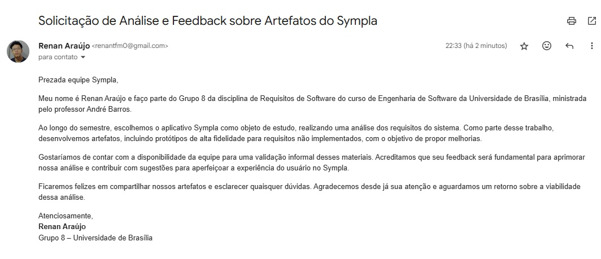
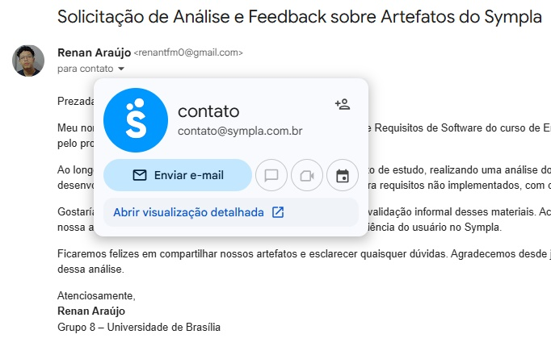

## Introdução

A comprovação informal é uma maneira mais descontraída e menos burocrática de garantir que os entregáveis de um projeto correspondam ao que os usuários esperam. Em vez de seguir padrões rígidos ou processos altamente controlados, a equipe pode adotar um método mais livre e adaptável.

Isso pode envolver conversas diretas com usuários, experimentação prática ou simplesmente observar como o produto é utilizado no dia a dia. Essa flexibilidade é especialmente valiosa nas fases iniciais do desenvolvimento, permitindo ajustes ágeis e refinamentos rápidos conforme necessário.

## Métodos de Comunicação

Para validar os artefatos desenvolvidos para o aplicativo Sympla, a equipe optou por um meio de comunicação direto e eficiente: o e-mail. Essa escolha possibilitou não apenas o compartilhamento detalhado dos resultados, mas também a formalização do processo, garantindo que todas as informações relevantes estivessem registradas e acessíveis para análise.

A mensagem foi encaminhada para o e-mail oficial associado ao Sympla. Esse formato foi escolhido por sua confiabilidade e praticidade na transmissão de dados importantes à equipe responsável pela revisão dos protótipos.

O e-mail foi enviado no dia 30/01, permitindo que a equipe tivesse acesso imediato aos materiais. Esse envio foi estrategicamente planejado para garantir que as informações chegassem no momento adequado, facilitando a revisão e possíveis ajustes no projeto.

<b>Figura 1:</b> E-mail enviado para o Sympla.

<b>Figura 2:</b> E-mail com o contato enviado para o Sympla.

Fonte: [Renan Araújo](https://github.com/renantfm4).

## Resultado

Até a data de entrega do artefato, em 03/02/2025, não houve qualquer retorno formal por parte da equipe do Sympla em relação à validação do material enviado.

Caso haja qualquer tipo de contato futuro por meio de redes sociais, e-mails ou outros canais de comunicação, essa interação será devidamente registrada e incorporada a este documento como comprovação informal da validação do que foi desenvolvido. Esse registro será fundamental para documentar o reconhecimento e eventuais ajustes necessários no projeto, garantindo a transparência e rastreabilidade do processo.

## Histórico de Versões

| Versão |          Descrição              |     Autor      |      Data      |   Revisor     | 
|:------:|:-------------------------------:|:--------------:|:--------------:|:-------------:|
|  1.0   | Criação desse documento | [Milena Rocha](https://github.com/MilenaFRocha)  | 30/01/2025 | [Victor Hugo](https://github.com/VHbernardes) |
|  1.1   | Comprovação Informal | [Renan Araújo](https://github.com/renantfm4)  | 03/02/2025 | |