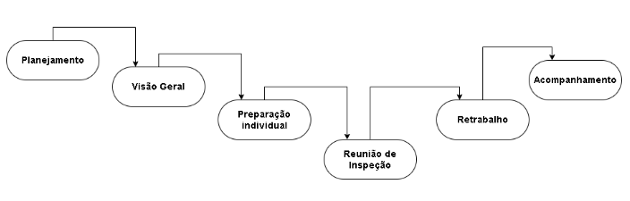

## Introdução

A etapa de verificação é fundamental no desenvolvimento de um projeto, pois é nela que os artefatos produzidos são revisados para assegurar que atendam aos requisitos estabelecidos.

## Objetivos

Esta seção tem como objetivo reunir as verificações de cada artefato do projeto, tanto desse grupo quanto do grupo +1, que é o Grupo 01. Neles, verificaremos se os artefatos criados pelo grupo estão de acordo com os padrões e requisitos definidos. É importante destacar que essas verificações se concentram exclusivamente nos artefatos, sem avaliações de cunho pessoal.

## Metodologia

O grupo optou pela metodologia de inspeção criada por Michael E. Fagan na IBM em 1976 <a id="anchor_1" href="#REF1">1</a> para realizar a verificação dos materiais. Para cada entrega foi elaborada uma lista de verificação dos artefatos baseando-se em alguma fonte externa e nos próprios requisitos do trabalho, e estas serão preenchidas em conjunto por todos os membros do grupo tanto para o próprio grupo quanto para o grupo +1. As verificações serão gravadas e disponibilizadas nas respectivas páginas. A figura 1 exemplifica as etapas que Fagan propôs para esse processo.

As verificações de cada artefato são dividas em dois documentos: planejamento e execução. No documento de planejamento, constrói-se a lista de verificação a partir da união das listas elaboradas por cada um dos membros do grupo 8, nele são apresentadas todas as fontes e documentos relacionados para localizar a origem dos itens. No documento de execução, é feita a inspeção e a verificação em si de cada artefato, avaliando cada um dos itens da lista. Esse documento é menos detalhado em relação à fontes que o primeiro, já que seu objetivo é apresentar de forma direta a avaliação dos itens.

**Figura 1:** Etapas da Inspeção proposta por Fagan

_Fonte: SOMMERVILLE (2007)._<a id="anchor_1" href="#REF1">^1^</a>

## **Referências bibliográficas**

> <a id="REF1" href="#anchor_1">1.</a> SOMMERVILLE, Ian. **Engenharia de software.** 08. ed. São Paulo: Pearson Addison Wesley, 2007

## Histórico de Versões

| Versão |          Descrição              |     Autor      |      Data      |   Revisor     | 
|:------:|:-------------------------------:|:--------------:|:--------------:|:-------------:|
|  1.0   | Criação desse documento | [Rafael Pereira](https://github.com/rafgpereira) | 03/02/2025 | [Milena Rocha](https://github.com/MilenaFRocha)  |
