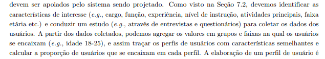
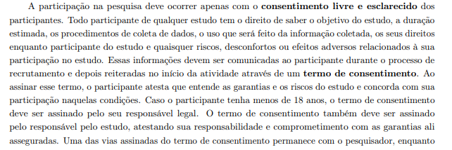

## Introdução

Após realizado o [planejamento](https://requisitos-de-software.github.io/2024.2-Sympla/verifica%C3%A7ao/grupo8/entrega1/), iremos apresentar nesse artefato a verificação dos itens propostos para a entrega 2 do grupo. 

## Objetivos

O objetivo deste documento é verificar se os artefatos produzidos para entrega 2 do grupo possuem os itens e o padrão exigidos para tais.

## Metodologia

Cada um dos itens da Tabela 1 será avaliado com Sim, Não ou Incompleto de acordo com o seu cumprimento. Para cada avaliação, será adicionada também a versão, iniciando em 1.0 e a data da última avaliação feita para aquele item.

## Verificação

Tabela 1: Critérios para a Entrega 2

| O github pages possui: |   Sim/Não/Incompleto   |  Versão da avaliação | Data da última avaliação |
|------|:-------------------------------:|:--------------:|:--------------:|
| **Itens do Desenvolvimento do projeto** |
| 1 - Todos os 9 itens. | Sim |  |  |
| **Itens do conteúdo da disciplina.** |
| 2 - A Especificação do Perfil do usuário possui informação de:   • **Idade** (criança, jovem, adulto, terceira idade etc.);   • **Experiência** (leigo/ novato, especialista);   • **Atitudes** (tecnófilos, tecnófobos);   • **tarefas primárias** (compra, venda) | Sim |  |  |
| 3 - Um cronograma (data e horário) e local para realização da elicitação dos requisitos com o do cliente e/ou persona do projeto? | Sim |  |  |
| 4 - No mínimo três técnicas de elicitação foram utilizadas (quanto mais melhor)? | Sim |  |  |
| 5 - A participação do cliente e/ou persona na elicitação de requisitos? | Sim |  |  |
| 6 - A gravação e o(s) registro(s) da elicitação dos requisitos (pré-rastreabilidade)? | Sim |  |  |
| 7 - Um cronograma (data e horário) e local para realização da priorização dos requisitos com o do cliente e/ou persona do projeto? | Sim |  |  |
| 8 - No mínimo duas técnicas de priorização (quanto mais melhor)?| Sim |  |  |
| 9 – A participação do cliente e/ou persona no processo de priorização? | Sim |  |  |
| 10 - A gravação e o(s) registro(s) da atividade de priorização dos requisitos? | Sim |  |  |
| **Itens do Conteúdo da disciplina feitas pelos integrantes** |
| 11 - As personas foram definidas de forma a representar grupos de usuários reais? <a id="anchor_1" href="#REF1">1</a> **Autor: Victor** | Sim |  | |
| 12 - Os objetivos principais das personas foram identificados e refinados durante a análise do domínio de atividade do usuário? <a id="anchor_2" href="#REF2">2</a> **Autor: Rafael**  | Sim |  | |
| 13 - Foram aplicados métodos (como entrevistas ou questionários) para coletar dados sobre os usuários? <a id="anchor_3" href="#REF3">3</a> **Autor: Milena** | Sim |  | |
| 14 - Foi apresentado um termo de consetimento para os participantes das técnicas? <a id="anchor_4" href="#REF4">4</a> **Autor: Renan** | Sim |  | |
| 15 - Dentre os Requisitos Elicitados estão os Funcionais e Não-Funcionais? <a id="anchor_5" href="#REF5">5</a> **Autor: Gabriel** | Sim |  |  |
| 16 - Cada integrante da equipe deve elaborar ao menos um 1 item de conteúdo da disciplina com referência bibliográfica da fonte e foto do texto da referência. <a id="anchor_6" href="#REF6">6</a> **Autor: Prof. André** | Sim |  | |

<b>Fonte:</b> Elaborado por <a href="https://github.com/VHbernardes">Victor Hugo</a>, 2024

## Vídeo

Abaixo, no Vídeo 1, apresentamos o processo de auto verificação do grupo, justificando a Tabela 1.

Vídeo 1: Auto Verificação Entrega 1 - Grupo 08 - Sympla

<b>Fonte:</b> Os Autores. Auto Verificação Entrega 2 - Grupo 08 - Sympla. Disponível em: <a href="https://youtu.be/QRVJSeqUjA4">https://youtu.be/QRVJSeqUjA4</a>. Acesso em: 05 nov. 2024.

## **Bibliografia**

> SALES, André Barros de. <a href="https://aprender3.unb.br/pluginfile.php/2972367/mod_resource/content/51/Plano_de_Ensino%20RE%20022024%20Turma%2002%20v1.pdf">Plano de Ensino - Requisitos de Software</a>. Acesso em: 24 de Nov. de 2024.

> BARBOSA, S. D. J.; SILVA, B. S. Interação Humano-Computador. Rio de Janeiro: Elsevier, 2011.

> SOMMERVILLE, Ian. Engenharia de Software. 9. ed. Tradução de Ivan Bosnic e Kalinka G. de O. Gonçalves. Revisão técnica de Kechi Hirama. São Paulo: Pearson Prentice Hall, 2011.

## **Referências bibliográficas**

><a id="REF2">1.</a> 
>****
><a id="REF3">2.</a> 
>****
><a id="REF4">3.</a> 
>****
><a id="REF5">4.</a> 
>****
><a id="REF6">5.</a>  

## Histórico de Versões

| Versão |          Descrição              |     Autor      |      Data      |   Revisor     | 
|:------:|:-------------------------------:|:--------------:|:--------------:|:-------------:|
|  1.0   | Criação desse documento | [Victor Hugo](https://github.com/VHbernardes) | 24/11/2024 | [Milena Rocha](https://github.com/MilenaFRocha)  |

