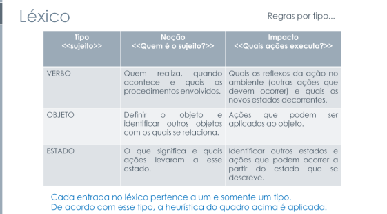
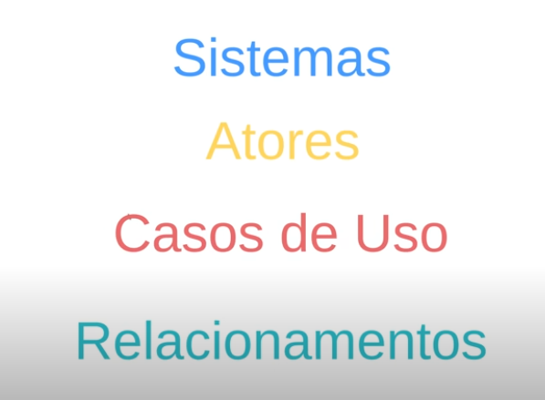

## Introdução

O artefato a seguir apresenta o planejamento para a verificação dos artefatos desenvolvidos pelo grupo, assegurando que todos os artefatos estejam em conformidade com os requisitos e padrões estabelecidos no checklist.

## Objetivos

O objetivo deste documento é definir os itens para verificar se os artefatos produzidos para entrega 3 do grupo possuem os itens e o padrão exigidos para tais. Os artefatos solicitados para a entrega 3 solicitados são: Cenários , Léxico, Use Case (Casos de uso), Especificação Suplementar.

A Tabela 1 apresenta os itens elaborados para a avaliação.

## Lista de verificação

Tabela 1: Critérios para a Entrega 3

| O github pages possui: |   Sim/Não/Incompleto   |  Versão da avaliação | Data da última avaliação |
|------|:-------------------------------:|:--------------:|:--------------:|
| **Itens do Desenvolvimento do projeto** |
| 1 - O histórico de versão padronizado? |  |  |  |
| 2 - O(s) autor(es) e o(s) revisor(es) para cada artefato? |  |  |  |
| 3 - Referências bibliográficas e/ou bibliografia em todos os artefatos? |  |  |  |
| 4 - As tabelas e imagens possuem título, fonte e elas chamadas dentro dos texto? |  |  |  |
| 5 - Um texto fazendo uma introdução dos artefatos? |  |  |  |
| 6 - O cronograma executado com quem realizou cada artefato/atividade com as datas de início e fim da construção/realização do artefato/atividade. |  |  |  |
| 7 - Ata(s) da(s) reuniões (com data, horário de início e do final, participantes, objetivo, atividades definidas etc). |  |  |  |
| 8 - A gravação da reunião do grupo |  |  |   |
| 9 - Vídeo de apresentação na categoria “não listado” no youtube? |  |  |  |
| **Itens do conteúdo da disciplina.** |
| 1 - As especificações dos cenários para o projeto. <a id="anchor_1" href="#REF1">1</a> |  |  |  |
| 2 - Os cenários possuem os elementos básicos de um cenário (Título, Metas/Objetivo, Contexto, Atores, Recursos, Exceção e Episódios)? <a id="anchor_2" href="#REF2">2</a> |  |  |  |
| 3 - As especificações dos Léxicos? <a id="anchor_3" href="#REF3">3</a>|  |  |  |
| 4 - A definição do usuário nos Léxicos? |  |  |  |
| 5 - Os léxicos possuem ligações entre si (hiper links)? |  |  |  |
| 6 - Os léxicos utilizam a estrutura de dicionário (verbo, objeto, estado)? <a id="anchor_4" href="#REF4">4</a>|  |  |  |
| 7 - A especificação do caso de uso? |  |  |  |
| 8 - Os atores principais e atores secundários no diagrama de caso de uso? <a id="anchor_5" href="#REF5">5</a>|  |  |  |
| 9 - O ator principal está do lado esquerdo do sistema no diagrama de caso de uso? <a id="anchor_6" href="#REF6">6</a>|  |  |  |
| 10 - Os atores estão fora da caixa de limite do sistema no diagrama de caso de uso? <a id="anchor_7" href="#REF7">7</a>|  |  |  |
| 11 - A especificação do diagrama de caso de uso (com Nome, Descrição, Atores, Pré-Condição,Pós-Condição, Fluxo Principal, Fluxo Alternativo e Fluxo de Exceção etc.)? <a id="anchor_8" href="#REF8">8</a> |  |  |  |
| 12 - No diagrama de Caso de Uso há ao menos um caso de uso com pontos de extensão? <a id="anchor_9" href="#REF9">9</a>|  |  |  |
| 13 - A participação do cliente e/ou persona na validação do Diagrama de Casa de Uso? |  |  |  |
| 14 - A especificação suplementar? <a id="anchor_10" href="#REF10">10</a>|  |  |  |
| 15- O artefato segue o modelo FURPS+? |  |  |  |
| 16 - O documento especifica o tempo de resposta, no Desempenho? |  |  |  |
| 17 - O documento especifica qual plataforma o aplicativo pode ser executado? |  |  |  |
| 18 - Todos os requisitos podem ser testados (RF e RNF)? |  |  |  |
| **Itens do Conteúdo da disciplina feitas pelos integrantes** |
| 1 - Todos os elementos necessários para a criação do diagrama de caso de uso estão sendo mostrados? (atores, relacionamentos, sistemas e casos de uso)  <a id="anchor_11" href="#REF11">11</a> **Autor: Victor** |  |  | |
| 2 - O nome da aplicação está no topo do sistema? <a id="anchor_12" href="#REF12">12</a> **Autor: Rafael**  |  |  | |
| 3 - O ator recebe um nome devidamente ligado a quem ele é? (Pessoa, Cliente, Organização, Outro sistema, Dispositivo externo) <a id="anchor_13" href="#REF13">13</a> **Autor: Milena** |  |  | |
| 4 - Está sendo usado verbos no infinitivo para mostras os casos de uso? <a id="anchor_14" href="#REF14">14</a> **Autor: Renan** |  |  | |
| 5 - O ator está interagindo com pelo menos um dos casos de uso dentro do sistema? <a id="anchor_15" href="#REF15">15</a> **Autor: Gabriel** |  |  |  |
| 6 - Cada integrante da equipe deve elaborar ao menos um 1 item de conteúdo da disciplina com referência bibliográfica da fonte e foto do texto da referência. **Autor: Prof. André** |  |  | |

<b>Fonte:</b> Elaborado por <a href="https://github.com/VHbernardes">Victor Hugo</a>, 2024

## **Bibliografia**

> SALES, André Barros de. <a href="https://aprender3.unb.br/pluginfile.php/2972367/mod_resource/content/51/Plano_de_Ensino%20RE%20022024%20Turma%2002%20v1.pdf">Plano de Ensino - Requisitos de Software</a>. Acesso em: 07 de Dez. 2024.

> SERRANO, Milene; SERRANO, Maurício. Apresentação Modelagem de Requisitos - Cenários, Léxicos e Ferramenta C&L. Brasília: UnB Gama, s.d. 1 apresentação em slides. Disponível em: [https://aprender3.unb.br/pluginfile.php/2972470/mod_resource/content/1/Aula%2010.pdf](https://aprender3.unb.br/pluginfile.php/2972470/mod_resource/content/1/Aula%2010.pdf). Acesso em: 07 de Dez. 2024.

> SERRANO, Milene; SERRANO, Maurício. Apresentação Modelagem de Requisitos - Casos de Uso e Especificação Suplementar. Brasília: UnB Gama, s.d. 1 apresentação em slides. Disponível em: [https://aprender3.unb.br/pluginfile.php/2972480/mod_resource/content/1/Requisitos%20-%20Aula%20013a.pdf](https://aprender3.unb.br/pluginfile.php/2972480/mod_resource/content/1/Requisitos%20-%20Aula%20013a.pdf). Acesso em: 07 de Dez. 2024.

> LUCID SOFTWARE PORTUGUÊS. Tutorial de Caso de Uso UML. YouTube, 25 abr. 2019. Disponível em: [https://youtu.be/ab6eDdwS3rA](https://youtu.be/ab6eDdwS3rA). Acesso em: 07 de Dez. 2024.

## **Referências bibliográficas**

><a id="REF1">1.</a> 
>****
><a id="REF2">2.</a> 
>****
><a id="REF3">3.</a> 
>****
><a id="REF4">4.</a> 
>****
><a id="REF5">5.</a> 
>****
><a id="REF6">6.</a> Vídeo - minuto 3:58  
>****
><a id="REF7">7.</a> Vídeo - minuto 2:55  
>****
><a id="REF8">8.</a> 
>****
><a id="REF9">9.</a> Vídeo - minuto 8:37  
>****
><a id="REF10">10.</a> 
>****
><a id="REF11">11.</a> Vídeo - minuto 1:37  
>****
><a id="REF12">12.</a> Vídeo - minuto 1:58  
>****
><a id="REF13">13.</a> Vídeo - minuto 2:24  
>****
><a id="REF14">14.</a> 
>****
><a id="REF15">15.</a> Vídeo - minuto 5:23  

## Histórico de Versões

| Versão |          Descrição              |     Autor      |      Data      |   Revisor     | 
|:------:|:-------------------------------:|:--------------:|:--------------:|:-------------:|
|  1.0   | Criação desse documento | [Victor Hugo](https://github.com/VHbernardes) | 07/12/2024 | [Rafael Pereira](https://github.com/rafgpereira) |

