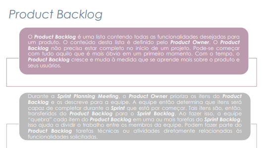
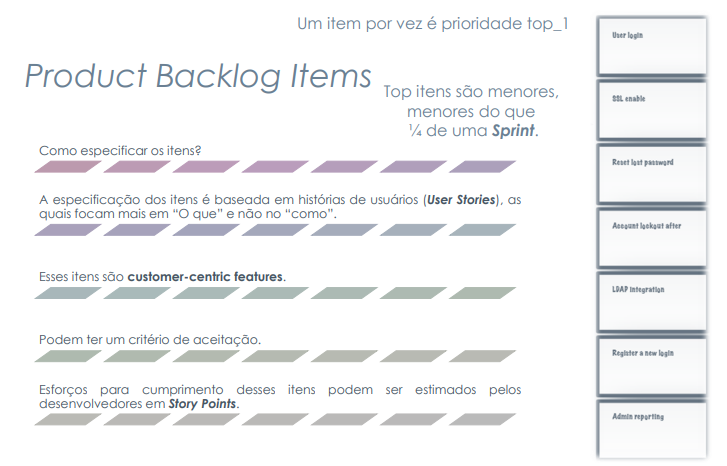
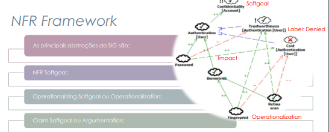

## Introdução

Após realizado o [planejamento](https://requisitos-de-software.github.io/2024.2-Sympla/verifica%C3%A7ao/grupo8/entrega4/entrega4/), iremos apresentar nesse artefato a verificação dos itens propostos para a entrega 4 do grupo. 

## Objetivos

O objetivo deste documento é verificar se os artefatos produzidos para entrega 4 do grupo possuem os itens e o padrão exigidos para tais.

## Metodologia

Cada um dos itens da Tabela 1 será avaliado com Sim, Não ou Incompleto de acordo com o seu cumprimento. Para cada avaliação, será adicionada também a versão, iniciando em 1.0 e a data da última avaliação feita para aquele item.

## Verificação

Tabela 1: Critérios para a Entrega 4

| O github pages possui: |   Sim/Não/Incompleto   |  Versão da avaliação | Data da última avaliação |
|------|:-------------------------------:|:--------------:|:--------------:|
| **Itens do Desenvolvimento do projeto** |
| 1 - O histórico de versão padronizado? | Sim | 1.0 | 17/12/2024 |
| 2 - O(s) autor(es) e o(s) revisor(es) para cada artefato? | Sim | 1.0 | 17/12/2024 |
| 3 - Referências bibliográficas e/ou bibliografia em todos os artefatos? | Sim | 1.0 | 17/12/2024 |
| 4 - As tabelas e imagens possuem título, fonte e elas chamadas dentro dos texto? |Sim | 1.0 | 17/12/2024 |
| 5 - Um texto fazendo uma introdução dos artefatos? | Sim | 1.0 | 17/12/2024  |
| 6 - O cronograma executado com quem realizou cada artefato/atividade com as datas de início e fim da construção/realização do artefato/atividade. | Sim | 1.0 | 17/12/2024  |
| 7 - Ata(s) da(s) reuniões (com data, horário de início e do final, participantes, objetivo, atividades definidas etc). | Sim | 1.0 | 17/12/2024  |
| 8 - A gravação da reunião do grupo | Sim | 1.0 | 17/12/2024  |
| 9 - Vídeo de apresentação na categoria “não listado” no youtube? | Sim | 1.0 | 17/12/2024  |
| **Itens do conteúdo da disciplina.** |
| 1 - As Histórias de Usuário? <a id="anchor_1" href="#REF1">1</a> |  Sim | 1.0 | 17/12/2024 |
| 2 - Os títulos das histórias de usuário são auto-explicativo? | Sim | 1.0 | 17/12/2024 |
| 3 - O “quem”, “o que” e o “por que” estão definidos na história de usuário? | Sim | 1.0 | 17/12/2024 |
| 4 - A participação do cliente e/ou persona na validação das histórias de usuário? | Sim | 1.0 | 17/12/2024  |
| 5 - A história possui critérios de aceitação? <a id="anchor_2" href="#REF2">2</a> |Sim | 1.0 | 17/12/2024 |
| 6 - Todas as histórias de usuários podem ser testadas? | Sim | 1.0 | 17/12/2024 |
| 7 - O backlog. <a id="anchor_3" href="#REF3">3</a>| Sim | 1.0 | 17/12/2024 |
| 8 - O backlog possui épicos e temas bem definidos e descritos? <a id="anchor_4" href="#REF4">4</a>|Sim | 1.0 | 17/12/2024 |
| 9 - As Histórias de Usuário seguem algum modelo ou padrão? | Sim | 1.0 | 17/12/2024 |
| 10 - NFR Framework <a id="anchor_5" href="#REF5">5</a> |Sim | 1.0 | 17/12/2024 |
| 11 - A definição do RNF e as fontes de evidência na literatura? |  Sim | 1.0 | 17/12/2024  |
| 12 - O cartão de especificação do RNF? <a id="anchor_6" href="#REF6">6</a>| Sim | 1.0 | 17/12/2024  |
| 13 - Os softgoals condizem com o contexto? <a id="anchor_7" href="#REF7">7</a>| Sim | 1.0 | 17/12/2024 |
| 14 - Softgoals representam metas bem definidas? | Sim | 1.0 | 17/12/2024 |
| 15 - Os impactos foram corretamente propagados? |  Sim | 1.0 | 17/12/2024 |
| **Itens do Conteúdo da disciplina feitas pelos integrantes** |
| 1 - Os itens do Backlog estão priorizados? <a id="anchor_8" href="#REF8">8</a> **Autor: Victor** | Sim | 1.0 | 17/12/2024 |
| 2 - O conteúdo do Product Backlog foi definido pelo Product Owner? <a id="anchor_9" href="#REF9">9</a> **Autor: Rafael**  | Sim | 1.0 | 17/12/2024 |
| 3 - É mostrado no NFR Framework os tipos de abstrações do SIG? (NFR Softgoal, Softgoal de operacionalização, Softgoal de afirmação) <a id="anchor_10" href="#REF10">10</a> **Autor: Milena** | Sim | 1.0 | 17/12/2024 |
| 4 - É mostrado no NFR Framework as decomposições do SIG? (Decomposição NFR, Decomposição de Operacionalização, Decomposição de Afirmação Decomposição de Priorização) <a id="anchor_11" href="#REF11">11</a> **Autor: Renan** | Sim | 1.0 | 17/12/2024  |
| 5 - A propagação de impactos foi feita de acordo com o padrão estabelecido? <a id="anchor_12" href="#REF12">12</a> **Autor: Gabriel** | Sim | 1.0 | 17/12/2024 |
| 6 - Cada integrante da equipe deve elaborar ao menos um 1 item de conteúdo da disciplina com referência bibliográfica da fonte e foto do texto da referência. **Autor: Prof. André** | Sim | 1.0 | 17/12/2024  |

<b>Fonte:</b> Elaborado por <a href="https://github.com/VHbernardes">Victor Hugo</a>, 2024

## Vídeo

Abaixo, no Vídeo 1, apresentamos o processo de auto verificação do grupo, justificando a Tabela 1.

Vídeo 1: Auto Verificação Entrega 4 - Grupo 08 - Sympla

<iframe width="560" height="315" src="https://www.youtube.com/embed/UHIURAZtjKU" title="YouTube video player" frameborder="0" allow="accelerometer; autoplay; clipboard-write; encrypted-media; gyroscope; picture-in-picture; web-share" referrerpolicy="strict-origin-when-cross-origin" allowfullscreen></iframe>

<b>Fonte:</b> Os Autores. Auto Verificação Entrega 4 - Grupo 08 - Sympla. Disponível em: <a href="https://www.youtube.com/watch?v=UHIURAZtjKU">https://www.youtube.com/watch?v=UHIURAZtjKU</a>. Acesso em: 17 de Dez. 2024.

## **Bibliografia**

> SALES, André Barros de. <a href="https://aprender3.unb.br/pluginfile.php/2972367/mod_resource/content/51/Plano_de_Ensino%20RE%20022024%20Turma%2002%20v1.pdf">Plano de Ensino - Requisitos de Software</a>. Acesso em: 07 de Dez. 2024.

> SERRANO, Milene; SERRANO, Maurício. Requisitos - aula 15. Brasília: UnB Gama, s.d. 1 apresentação em slides. Disponível em: [https://aprender3.unb.br/pluginfile.php/2972504/mod_resource/content/1/Requisitos%20-%20Aula%2015a.pdf](https://aprender3.unb.br/pluginfile.php/2972504/mod_resource/content/1/Requisitos%20-%20Aula%2015a.pdf). Acesso em: 07 de Dez. 2024.

> SERRANO, Milene; SERRANO, Maurício. Requisitos - aula 17. Brasília: UnB Gama, s.d. 1 apresentação em slides. Disponível em: [https://aprender3.unb.br/pluginfile.php/2972516/mod_resource/content/1/Requisitos%20-%20Aula%20019a.pdf](https://aprender3.unb.br/pluginfile.php/2972516/mod_resource/content/1/Requisitos%20-%20Aula%20019a.pdf). Acesso em: 17 de Dez. 2024.

> ARAÚJO, Kleitor Franklint Corrêa. Modelagem com histórias: bem além dos requisitos. 2018. Disponível em: https://pt.slideshare.net/slideshow/modelagem-com-historias-bem-alm-dos-requisitos-84628101/84628101. Acesso em: 17 dez. 2024.

> SILVA, Reinaldo Antônio da. NFR4ES: Um Catálogo de Requisitos Não-Funcionais para Sistemas Embarcados. 2019. Dissertação (Mestrado em Ciências da Computação) – Universidade Federal de Pernambuco, Recife, 2019. Disponível em: [https://aprender3.unb.br/pluginfile.php/2972515/mod_resource/content/2/DISSERTA%C3%87%C3%83O%20Reinaldo%20Ant%C3%B4nio%20da%20Silva.pdf](https://aprender3.unb.br/pluginfile.php/2972515/mod_resource/content/2/DISSERTA%C3%87%C3%83O%20Reinaldo%20Ant%C3%B4nio%20da%20Silva.pdf). Acesso em: 17 dez. 2024.

## **Referências bibliográficas**

><a id="REF1">1.</a> 
>****
><a id="REF2">2.</a> 
>****
><a id="REF3">3.</a> 
>****
><a id="REF4">4.</a> 
>****
><a id="REF5">5.</a> 
>****
><a id="REF6">6.</a> 
>****
><a id="REF7">7.</a> 
>****
><a id="REF8">8.</a> 
>****
><a id="REF9">9.</a> 
>****
><a id="REF10">10.</a> 
>****
><a id="REF11">11.</a> 
>****
><a id="REF12">12.</a> 

## Histórico de Versões

| Versão |          Descrição              |     Autor      |      Data      |   Revisor     | 
|:------:|:-------------------------------:|:--------------:|:--------------:|:-------------:|
|  1.0   | Criação desse documento | [Victor Hugo](https://github.com/VHbernardes) | 17/12/2024 | [Rafael Pereira](https://github.com/rafgpereira) |
|  1.1   | Validação v1.0 | [Rafael Pereira](https://github.com/rafgpereira) | 17/12/2024 | [Milena Rocha](https://github.com/MilenaFRocha) |
|  1.2   | Adição do vídeo de auto inspeção | [Victor Hugo](https://github.com/VHbernardes) | 17/12/2024 | [Milena Rocha](https://github.com/MilenaFRocha) |