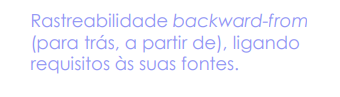
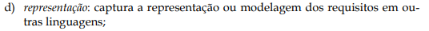

## Introdução

O artefato a seguir apresenta o planejamento para a verificação dos artefatos desenvolvidos pelo grupo, assegurando que todos os artefatos estejam em conformidade com os requisitos e padrões estabelecidos no checklist.

## Objetivos

O objetivo deste documento é definir os itens para verificar se os artefatos produzidos para entrega 6 do grupo possuem os itens e o padrão exigidos para tais. Os artefatos solicitados para a entrega 6 solicitados são: Pós-Rastreabilidade - Gerência II.

A Tabela 1 apresenta os itens elaborados para a avaliação.

## Lista de verificação

Tabela 1: Critérios para a Entrega 6

| O github pages possui: |   Sim/Não/Incompleto   |  Versão da avaliação | Data da última avaliação |
|------|:-------------------------------:|:--------------:|:--------------:|
| **Itens do Desenvolvimento do projeto** |
| 1 - O histórico de versão padronizado? |  |  |  |
| 2 - O(s) autor(es) e o(s) revisor(es) para cada artefato? |  |  |  |
| 3 - Referências bibliográficas e/ou bibliografia em todos os artefatos? |  |  |  |
| 4 - As tabelas e imagens possuem título, fonte e elas chamadas dentro dos texto? |  |  |  |
| 5 - Um texto fazendo uma introdução dos artefatos? |  |  |  |
| 6 - O cronograma executado com quem realizou cada artefato/atividade com as datas de início e fim da construção/realização do artefato/atividade. |  |  |  |
| 7 - Ata(s) da(s) reuniões (com data, horário de início e do final, participantes, objetivo, atividades definidas etc). |  |  |  |
| 8 - A gravação da reunião do grupo |  |  |   |
| 9 - Vídeo de apresentação na categoria “não listado” no youtube? |  |  |  |
| **Itens do conteúdo da disciplina.** |
| 1 - É apresentado a matriz de rastreabilidade? **Autor: Renan** <a id="anchor_1" href="#REF1">1</a> |  |  |  |
| 2 - É apresentado a Backward-from no artefato de Pós Rastreabiidade? **Autor: Victor** <a id="anchor_2" href="#REF2">2</a>|  |  |  |
| 3 - É apresentado a Forward-from no artefato de Pós Rastreabiidade? **Autor: Victor** <a id="anchor_3" href="#REF3">3</a>|  |  |  |
| 4 - É apresentado os tipos de Elos de Rastreabilidade? **Autor: Rafael** <a id="anchor_4" href="#REF4">4</a>|  |  |  |
| 5 - Está sendo utilizado o Meta-modelo de Toranzo para a Pós-Rastreabilidade? **Autor: Rafael** <a id="anchor_5" href="#REF5">5</a> |  |  |  |
| 6 - Está sendo apresentado as classificações dos quatro níveis do Meta-modelo de Toranzo? **Autor: Milena** <a id="anchor_6" href="#REF6">6</a>|  |  |  |
| 7 - Está sendo apresentado os elos de rastreabilidade do Meta-modelo de Toranzo? **Autor: Milena** <a id="anchor_7" href="#REF7">7</a>|  |  |  |
| 8 - Está sendo seguido o padrão imposto pelos tipos de elos de rastreabilidade de toranzo? Exemplo: a categoria, os elementos rastreáveis e os elos. **Autor: Renan** <a id="anchor_8" href="#REF8">8</a>|  |  |  |
| 9 - Na representação, dentro do modelo de Toranzo, está sendo mostrado uma captura(imagem) do requisito implementado? **Autor: Gabriel** <a id="anchor_9" href="#REF9">9</a>|  |  |  |
| 10 - Os elos de rastreabilidade estão sendo apresentados e bem documentados? **Autor: Gabriel** <a id="anchor_10" href="#REF10">10</a>|  |  |  |

<b>Fonte:</b> Elaborado por <a href="https://github.com/VHbernardes">Victor Hugo</a>, 2025

## **Bibliografia**

> SALES, André Barros de. <a href="https://aprender3.unb.br/pluginfile.php/2972367/mod_resource/content/51/Plano_de_Ensino%20RE%20022024%20Turma%2002%20v1.pdf">Plano de Ensino - Requisitos de Software</a>. Acesso em: 18 jan. 2025..

> SERRANO, Milene; SERRANO, Maurício. Requisitos - aula 26. Brasília: UnB Gama, s.d. 1 apresentação em slides. Disponível em: [https://aprender3.unb.br/pluginfile.php/2972560/mod_resource/content/1/Requisitos%20-%20Aula%20026.pdf](https://aprender3.unb.br/pluginfile.php/2972560/mod_resource/content/1/Requisitos%20-%20Aula%20026.pdf). Acesso em: 18 jan. 2025.

> SAYÃO, Miriam; DO PRADO LEITE, Julio Cesar Sampaio. Rastreabilidade de requisitos. RITA, v. 13, n. 1, p. 57-86, 2006. Disponível em: [https://aprender3.unb.br/pluginfile.php/2972563/mod_resource/content/3/05_20_sayao.pdf](https://aprender3.unb.br/pluginfile.php/2972563/mod_resource/content/3/05_20_sayao.pdf). Acesso em: 18 jan. 2025.

## **Referências bibliográficas**

><a id="REF1">1.</a> 
>****
><a id="REF2">2.</a> 
>****
><a id="REF3">3.</a> 
>****
><a id="REF4">4.</a> 
>****
><a id="REF5">5.</a> 
>****
><a id="REF6">6.</a> 
>****
><a id="REF7">7.</a> 
>****
><a id="REF8">8.</a> 
>****
><a id="REF9">9.</a> 
>****
><a id="REF10">10.</a> 

## Histórico de Versões

| Versão |          Descrição              |     Autor      |      Data      |   Revisor     | 
|:------:|:-------------------------------:|:--------------:|:--------------:|:-------------:|
|  1.0   | Criação desse documento | [Victor Hugo](https://github.com/VHbernardes) | 18/01/2025 | [Rafael Pereira](https://github.com/rafgpereira) |

